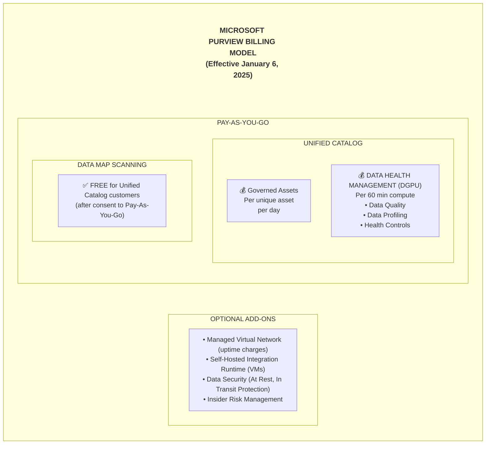
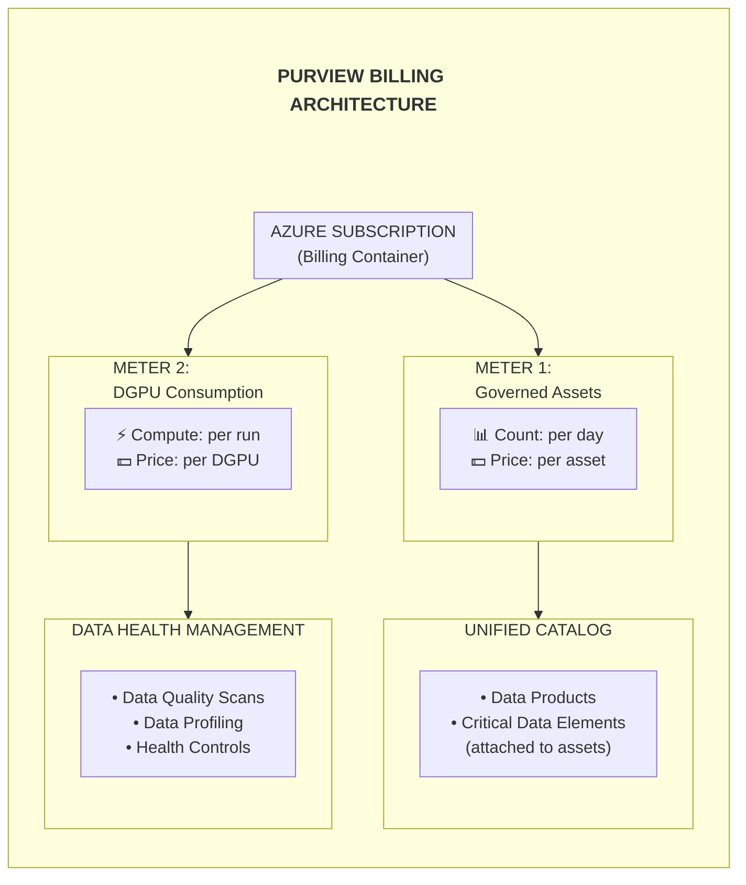
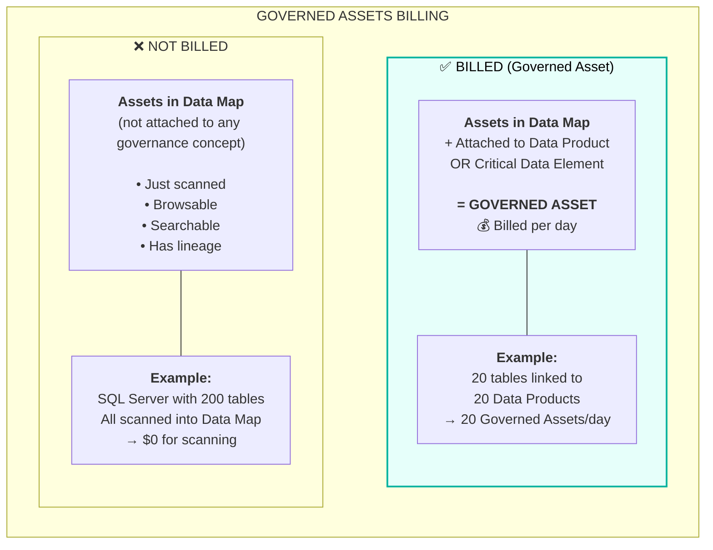
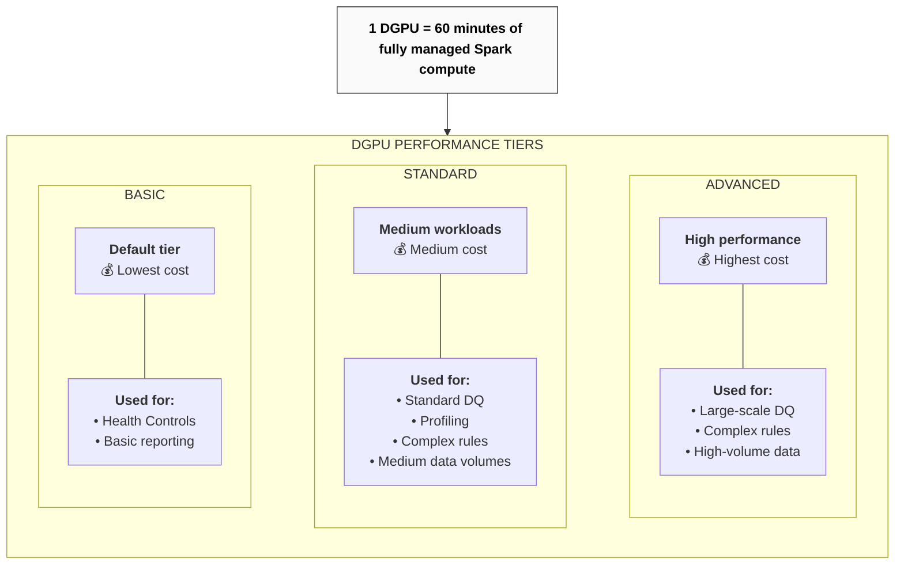

# Microsoft Purview - Guide Complet de Facturation et Coûts


**Contexte:** Analyse des coûts Microsoft Purview pour Data Governance avec focus sur l'intégration Fabric

---

## Table des Matières

1. [Vue d'ensemble de la facturation](#1-vue-densemble-de-la-facturation)
2. [Architecture de facturation](#2-architecture-de-facturation)
3. [Unified Catalog - Governed Assets](#3-unified-catalog---governed-assets)
4. [Data Quality - DGPU](#4-data-quality---dgpu)
5. [Data Map - Scanning](#5-data-map---scanning)
6. [Managed Virtual Network - Coûts additionnels](#6-managed-virtual-network---coûts-additionnels)
7. [Intégration Microsoft Fabric](#7-intégration-microsoft-fabric)
8. [Use Cases et Scénarios](#8-use-cases-et-scénarios)
9. [Matrice de coûts par taille d'entreprise](#9-matrice-de-coûts-par-taille-dentreprise)
10. [Optimisation des coûts](#10-optimisation-des-coûts)
11. [Références](#11-références)

---

## 1. Vue d'ensemble de la facturation

### Modèle de facturation actuel (depuis Janvier 2025)

Microsoft Purview utilise un modèle **Pay-As-You-Go** pour les fonctionnalités de Data Governance.



### Points clés du modèle actuel

| Composant | Facturation |
|-----------|-------------|
| **Data Map Scanning** | ✅ **Gratuit** (inclus dans PAYG) |
| **Data Map Capacity Units** | ✅ **Gratuit** (inclus dans PAYG) |
| **Insights Generation** | ✅ **Gratuit** (inclus dans PAYG) |
| **Governed Assets** | 💰 **Payant** (par asset/jour) |
| **Data Quality (DGPU)** | 💰 **Payant** (par DGPU) |

---

## 2. Architecture de facturation

### Composants facturés



### Flux de facturation

```
User Activity                          Billing Meters                Cost
─────────────────────────────────────────────────────────────────────────────

1. Scan Data Sources ─────────────────► (No charge) ───────────────► $0
                                        Included in PAYG

2. Register in Data Map ──────────────► (No charge) ───────────────► $0
                                        Included in PAYG

3. Attach Asset to ───────────────────► Governed Asset ────────────► $X/day
   Data Product                         Meter starts

4. Run Data Quality ──────────────────► DGPU Consumption ──────────► $Y/DGPU
   Scan                                 Based on compute time

5. View Insights, ────────────────────► (No charge) ───────────────► $0
   Browse Catalog                       Included in PAYG
```

---

## 3. Unified Catalog - Governed Assets

### Qu'est-ce qu'un Governed Asset ?

Un **Governed Asset** est un asset technique (table, fichier, rapport) qui est **attaché à un concept de gouvernance** :
- Data Product
- Critical Data Element (CDE)



### Règles de comptage

| Scénario | Comptage | Explication |
|----------|----------|-------------|
| 1 table → 5 Data Products | **1** governed asset | Comptée une seule fois par jour |
| 50 Data Products sans assets | **0** governed assets | Pas d'assets attachés = pas de facturation |
| 1 Server attaché (pas les tables) | **1** governed asset | Seul le server compte, pas les enfants |
| 1 table + glossary + policy | **1** governed asset | Un asset reste un asset |

### Tarification Governed Assets

| Région | Prix estimé* |
|--------|--------------|
| West Europe | ~$0.004 - $0.006 per asset/day |
| East US | ~$0.004 - $0.006 per asset/day |
| France Central | ~$0.004 - $0.006 per asset/day |

> *Vérifier les prix actuels sur [Azure Pricing Calculator](https://azure.microsoft.com/pricing/calculator/?service=purview)

### Calcul mensuel

```
Monthly Governed Assets Cost = 
    (Number of Governed Assets) × (Price per Asset/Day) × 30 days

Example:
    100 governed assets × $0.005/day × 30 = $15/month
    500 governed assets × $0.005/day × 30 = $75/month
    1000 governed assets × $0.005/day × 30 = $150/month
```

---

## 4. Data Quality - DGPU

### Qu'est-ce qu'un DGPU ?

**DGPU (Data Governance Processing Unit)** = 60 minutes de compute managé pour :
- Data Quality scans
- Data Profiling
- Health Controls



### Consommation DGPU par type de règle

| Data Source | Row Count | SKU | Rule Type | DGPU per run |
|-------------|-----------|-----|-----------|--------------|
| Azure SQL DB | 1 Million | Basic | Empty/Blank check | 0.02 |
| Azure SQL DB | 1 Million | Basic | Regex/Format check | 0.02 |
| Azure SQL DB | 1 Million | Basic | Table Lookup | 0.03 |
| Azure SQL DB | 1 Million | Basic | Unique check | 0.02 |
| Azure SQL DB | 1 Million | Basic | Duplicate check (3 cols) | 0.02 |

### Consommation par volume de données

| Rule Complexity | 10K rows | 100K rows | 1M rows | 10M rows | 100M rows | 1B rows |
|-----------------|----------|-----------|---------|----------|-----------|---------|
| **Simple** (blank check) | 0.02 | 0.02 | 0.02 | 0.02 | 0.02 | 0.03 |
| **Medium** (format, unique) | 0.02 | 0.02 | 0.02 | 0.02 | 0.03 | 0.03 |
| **Complex** (duplicate, lookup) | 0.02 | 0.02 | 0.03 | 0.03 | 0.03 | 0.04 |

### Tarification DGPU

| Performance Tier | Prix estimé* (West Europe) |
|------------------|---------------------------|
| Basic | ~$0.15 - $0.20 per DGPU |
| Standard | ~$0.50 - $0.70 per DGPU |
| Advanced | ~$1.00 - $1.50 per DGPU |

> *Vérifier les prix actuels sur [Azure Pricing Calculator](https://azure.microsoft.com/pricing/calculator/?service=purview)

### Exemple de calcul mensuel

```
Scenario: Medium enterprise, daily DQ scans

Daily DQ Jobs:
├── 50 tables × 2 rules each = 100 rule executions
├── Average DGPU per rule = 0.02
├── Daily DGPU = 100 × 0.02 = 2 DGPUs

Monthly DGPU:
├── 2 DGPUs × 30 days = 60 DGPUs

Monthly Cost (Standard tier):
├── 60 DGPUs × $0.60/DGPU = $36/month
```

---

## 5. Data Map - Scanning

### Facturation Data Map avec Unified Catalog

> **✅ Les charges Data Map sont INCLUSES (gratuites) pour les clients Unified Catalog (PAYG)**

| Composant | Facturation |
|-----------|-------------|
| Data Map Capacity Units | ✅ **Inclus dans PAYG** |
| Scanning vCore hours | ✅ **Inclus dans PAYG** |
| Insights Generation | ✅ **Inclus dans PAYG** |
| SHIR Usage | Coût infrastructure VM uniquement |

```
┌─────────────────────────────────────────────────────────────────────────────┐
│                         DATA MAP - INCLUS DANS PAYG                         │
├─────────────────────────────────────────────────────────────────────────────┤
│                                                                             │
│   ✅ INCLUS SANS FRAIS SUPPLÉMENTAIRES:                                     │
│                                                                             │
│   • Scanning de toutes les data sources supportées                          │
│   • Capacity Units (stockage métadonnées)                                   │
│   • Classification automatique                                              │
│   • Lineage tracking                                                        │
│   • Insights et reporting                                                   │
│   • Browse et Search dans le catalogue                                      │
│                                                                             │
│   💡 Facturation uniquement pour:                                           │
│   • Governed Assets (assets attachés aux Data Products)                     │
│   • DGPU (Data Quality, Profiling)                                          │
│                                                                             │
└─────────────────────────────────────────────────────────────────────────────┘
```

---

## 6. Managed Virtual Network - Coûts additionnels

### Quand est-ce nécessaire ?

Managed VNet est requis pour accéder aux data sources protégées par :
- Private endpoints
- Firewall
- VNet service endpoints

```
┌─────────────────────────────────────────────────────────────────────────────┐
│                   MANAGED VNET ADDITIONAL COSTS                             │
├─────────────────────────────────────────────────────────────────────────────┤
│                                                                             │
│   ┌─────────────────────────────────────────────────────────────────────┐   │
│   │                     COST COMPONENTS                                 │   │
│   ├─────────────────────────────────────────────────────────────────────┤   │
│   │                                                                     │   │
│   │   1. DGPU CONSUMPTION (same as without VNet)                        │   │
│   │      └── Pay per DQ job execution                                   │   │
│   │                                                                     │   │
│   │   2. MANAGED VNET IR UPTIME (additional charge) ⚠️                  │   │
│   │      └── Charged from provisioning until deletion                   │   │
│   │      └── 1/8 vCore hour × lifetime × unit price                     │   │
│   │      └── ALWAYS-ON charge (even when not scanning)                  │   │
│   │                                                                     │   │
│   └─────────────────────────────────────────────────────────────────────┘   │
│                                                                             │
│   UPTIME COST CALCULATION:                                                  │
│                                                                             │
│   ┌─────────────────────────────────────────────────────────────────────┐   │
│   │                                                                     │   │
│   │   Monthly Managed VNet IR Cost =                                    │   │
│   │       730 hours/month × 1/8 vCore × $0.63/vCore hour                │   │
│   │     = 730 × 0.125 × $0.63                                           │   │
│   │     ≈ $57.49/month (base charge)                                    │   │
│   │                                                                     │   │
│   │   This is IN ADDITION to DGPU consumption costs                     │   │
│   │                                                                     │   │
│   └─────────────────────────────────────────────────────────────────────┘   │
│                                                                             │
└─────────────────────────────────────────────────────────────────────────────┘
```

### Comparaison avec/sans Managed VNet

| Scenario | Sans Managed VNet | Avec Managed VNet |
|----------|-------------------|-------------------|
| Monthly DGPU (60 DGPUs) | $36 | $36 |
| Managed VNet IR Uptime | $0 | ~$57 |
| **Total mensuel** | **$36** | **$93** |

### Quand utiliser Managed VNet ?

| Scenario | Managed VNet ? | Justification |
|----------|----------------|---------------|
| Data sources avec public endpoints | ❌ Non | Pas nécessaire |
| Data sources avec private endpoints | ✅ Oui | Requis |
| Exigence compliance network isolation | ✅ Oui | Sécurité renforcée |
| POC / Test environment | ❌ Non | Commencer simple |
| Production avec données sensibles | ✅ Oui | Best practice |

---

## 7. Intégration Microsoft Fabric

### Scénario : Purview + Fabric Data Mesh

```
┌─────────────────────────────────────────────────────────────────────────────┐
│                     FABRIC + PURVIEW INTEGRATION                            │
├─────────────────────────────────────────────────────────────────────────────┤
│                                                                             │
│   ┌─────────────────────────────────────────────────────────────────────┐   │
│   │                   MICROSOFT FABRIC                                  │   │
│   │                                                                     │   │
│   │   ┌───────────┐  ┌───────────┐  ┌───────────┐  ┌───────────┐       │   │
│   │   │ Lakehouse │  │ Warehouse │  │ Power BI  │  │ Data      │       │   │
│   │   │           │  │           │  │ Semantic  │  │ Factory   │       │   │
│   │   │ • Tables  │  │ • Tables  │  │ Models    │  │ Pipelines │       │   │
│   │   │ • Files   │  │ • Views   │  │           │  │           │       │   │
│   │   └─────┬─────┘  └─────┬─────┘  └─────┬─────┘  └─────┬─────┘       │   │
│   │         │              │              │              │             │   │
│   │         └──────────────┴──────────────┴──────────────┘             │   │
│   │                              │                                     │   │
│   │                    Live View / Scan                                │   │
│   │                              │                                     │   │
│   └──────────────────────────────┼─────────────────────────────────────┘   │
│                                  │                                         │
│                                  ▼                                         │
│   ┌─────────────────────────────────────────────────────────────────────┐   │
│   │                   MICROSOFT PURVIEW                                 │   │
│   │                                                                     │   │
│   │   ┌─────────────────────────┐     ┌─────────────────────────────┐   │   │
│   │   │       DATA MAP          │     │     UNIFIED CATALOG         │   │   │
│   │   │                         │     │                             │   │   │
│   │   │  • Fabric assets        │     │  • Data Products            │   │   │
│   │   │  • Schema               │────►│  • Glossary Terms           │   │   │
│   │   │  • Lineage              │     │  • Data Quality             │   │   │
│   │   │  • Classifications      │     │  • Policies                 │   │   │
│   │   │                         │     │                             │   │   │
│   │   │  ✅ FREE (PAYG)         │     │  💰 Governed Assets         │   │   │
│   │   │                         │     │  💰 DGPU for DQ             │   │   │
│   │   └─────────────────────────┘     └─────────────────────────────┘   │   │
│   │                                                                     │   │
│   └─────────────────────────────────────────────────────────────────────┘   │
│                                                                             │
└─────────────────────────────────────────────────────────────────────────────┘
```

### Coûts spécifiques Fabric + Purview

| Élément | Coût Purview | Notes |
|---------|--------------|-------|
| **Scan Fabric workspace** | ✅ Gratuit | Inclus dans PAYG |
| **Live View metadata** | ✅ Gratuit | Pas de scan requis |
| **Lineage Fabric→Purview** | ✅ Gratuit | Automatique |
| **Fabric tables as Governed Assets** | 💰 Per asset/day | Si attachées à Data Products |
| **DQ on Fabric Lakehouse** | 💰 DGPU | Par exécution |
| **Sensitivity Labels on Fabric** | M365 E5 license | Licensing séparé |

### Exemple : Data Mesh LNCA avec Fabric

```
LNCA Data Mesh Structure:

├── Fabric Capacity (F64)
│   ├── Lakehouse: lnca_bronze (100 tables)
│   ├── Lakehouse: lnca_silver (50 tables)
│   ├── Lakehouse: lnca_gold (20 tables)
│   ├── Warehouse: lnca_analytics (30 tables)
│   └── Power BI Semantic Models (10 models)
│
└── Purview Governance
    ├── Data Map: All 210 assets scanned ───────────► $0 (free)
    │
    ├── Unified Catalog:
    │   ├── Gold tier tables (20) → Data Products ──► 20 governed assets/day
    │   ├── Semantic Models (10) → Data Products ───► 10 governed assets/day
    │   └── Key Silver tables (10) → CDEs ──────────► 10 governed assets/day
    │   │
    │   └── Total: 40 governed assets/day
    │       Monthly: 40 × $0.005 × 30 = $6/month
    │
    └── Data Quality:
        ├── 40 tables × 3 rules × daily = 120 DQ jobs/day
        ├── Average 0.02 DGPU per job = 2.4 DGPU/day
        ├── Monthly: 2.4 × 30 = 72 DGPUs
        └── Cost: 72 × $0.60 = $43.20/month
```

### Total estimé Fabric + Purview (LNCA)

| Composant | Coût mensuel |
|-----------|--------------|
| Governed Assets (40) | ~$6 |
| DGPU Data Quality | ~$43 |
| Managed VNet (si requis) | ~$57 |
| **Total sans VNet** | **~$49/month** |
| **Total avec VNet** | **~$106/month** |

> Note: Ces coûts sont **en plus** du coût de la capacité Fabric.

---

## 8. Use Cases et Scénarios

### Use Case 1: POC / Pilot (3 mois)

```
┌─────────────────────────────────────────────────────────────────────────────┐
│   USE CASE 1: POC / PILOT                                                   │
├─────────────────────────────────────────────────────────────────────────────┤
│                                                                             │
│   Scope:                                                                    │
│   • 5 data sources (Azure SQL, Data Lake, Fabric)                          │
│   • 50 tables total                                                         │
│   • 10 Data Products                                                        │
│   • Basic DQ rules (weekly scans)                                           │
│   • Public endpoints (no Managed VNet)                                      │
│                                                                             │
│   ┌─────────────────────────────────────────────────────────────────────┐   │
│   │   MONTHLY COST BREAKDOWN                                            │   │
│   ├─────────────────────────────────────────────────────────────────────┤   │
│   │                                                                     │   │
│   │   Scanning 5 sources                    $0 (included)               │   │
│   │   Governed Assets (10 tables)           10 × $0.005 × 30 = $1.50    │   │
│   │   DGPU (10 tables × 2 rules × 4/month)  0.8 DGPU × $0.60 = $0.48    │   │
│   │   ─────────────────────────────────────────────────────────         │   │
│   │   TOTAL MONTHLY                         ~$2/month                   │   │
│   │   TOTAL 3-MONTH POC                     ~$6                         │   │
│   │                                                                     │   │
│   └─────────────────────────────────────────────────────────────────────┘   │
│                                                                             │
└─────────────────────────────────────────────────────────────────────────────┘
```

### Use Case 2: Small Enterprise Production

```
┌─────────────────────────────────────────────────────────────────────────────┐
│   USE CASE 2: SMALL ENTERPRISE                                              │
├─────────────────────────────────────────────────────────────────────────────┤
│                                                                             │
│   Scope:                                                                    │
│   • 20 data sources                                                         │
│   • 500 tables in Data Map                                                  │
│   • 100 governed assets (Data Products)                                     │
│   • Daily DQ scans on governed assets                                       │
│   • Private endpoints (Managed VNet required)                               │
│   • 2 governance domains                                                    │
│                                                                             │
│   ┌─────────────────────────────────────────────────────────────────────┐   │
│   │   MONTHLY COST BREAKDOWN                                            │   │
│   ├─────────────────────────────────────────────────────────────────────┤   │
│   │                                                                     │   │
│   │   Scanning 20 sources                   $0 (included)               │   │
│   │   Governed Assets (100)                 100 × $0.005 × 30 = $15     │   │
│   │   DGPU (100 × 2 rules × daily)          120 DGPU × $0.60 = $72      │   │
│   │   Managed VNet IR                       $57                         │   │
│   │   ─────────────────────────────────────────────────────────         │   │
│   │   TOTAL MONTHLY                         ~$144/month                 │   │
│   │   TOTAL ANNUAL                          ~$1,728/year                │   │
│   │                                                                     │   │
│   └─────────────────────────────────────────────────────────────────────┘   │
│                                                                             │
└─────────────────────────────────────────────────────────────────────────────┘
```

### Use Case 3: Medium Enterprise

```
┌─────────────────────────────────────────────────────────────────────────────┐
│   USE CASE 3: MEDIUM ENTERPRISE                                             │
├─────────────────────────────────────────────────────────────────────────────┤
│                                                                             │
│   Scope:                                                                    │
│   • 50 data sources                                                         │
│   • 2,000 tables in Data Map                                                │
│   • 500 governed assets                                                     │
│   • Daily DQ + weekly profiling                                             │
│   • Managed VNet + 2 regions                                                │
│   • 5 governance domains                                                    │
│   • Fabric integration (Data Mesh)                                          │
│                                                                             │
│   ┌─────────────────────────────────────────────────────────────────────┐   │
│   │   MONTHLY COST BREAKDOWN                                            │   │
│   ├─────────────────────────────────────────────────────────────────────┤   │
│   │                                                                     │   │
│   │   Scanning 50 sources                   $0 (included)               │   │
│   │   Governed Assets (500)                 500 × $0.005 × 30 = $75     │   │
│   │   DGPU DQ (500 × 3 rules × daily)       900 DGPU × $0.60 = $540     │   │
│   │   DGPU Profiling (weekly)               50 DGPU × $0.60 = $30       │   │
│   │   Managed VNet IR (2 regions)           $57 × 2 = $114              │   │
│   │   ─────────────────────────────────────────────────────────         │   │
│   │   TOTAL MONTHLY                         ~$759/month                 │   │
│   │   TOTAL ANNUAL                          ~$9,108/year                │   │
│   │                                                                     │   │
│   └─────────────────────────────────────────────────────────────────────┘   │
│                                                                             │
└─────────────────────────────────────────────────────────────────────────────┘
```

### Use Case 4: Large Enterprise

```
┌─────────────────────────────────────────────────────────────────────────────┐
│   USE CASE 4: LARGE ENTERPRISE                                              │
├─────────────────────────────────────────────────────────────────────────────┤
│                                                                             │
│   Scope:                                                                    │
│   • 200+ data sources                                                       │
│   • 10,000+ tables in Data Map                                              │
│   • 2,000 governed assets                                                   │
│   • Continuous DQ monitoring                                                │
│   • Managed VNet + 5 regions                                                │
│   • 20+ governance domains                                                  │
│   • Multi-cloud (Azure, AWS, GCP)                                           │
│   • Full Fabric Data Mesh                                                   │
│                                                                             │
│   ┌─────────────────────────────────────────────────────────────────────┐   │
│   │   MONTHLY COST BREAKDOWN                                            │   │
│   ├─────────────────────────────────────────────────────────────────────┤   │
│   │                                                                     │   │
│   │   Scanning 200 sources                  $0 (included)               │   │
│   │   Governed Assets (2,000)               2000 × $0.005 × 30 = $300   │   │
│   │   DGPU DQ (2000 × 3 rules × daily)      3600 DGPU × $0.60 = $2,160  │   │
│   │   DGPU Profiling + Health Controls      200 DGPU × $0.60 = $120     │   │
│   │   Managed VNet IR (5 regions)           $57 × 5 = $285              │   │
│   │   ─────────────────────────────────────────────────────────         │   │
│   │   TOTAL MONTHLY                         ~$2,865/month               │   │
│   │   TOTAL ANNUAL                          ~$34,380/year               │   │
│   │                                                                     │   │
│   └─────────────────────────────────────────────────────────────────────┘   │
│                                                                             │
└─────────────────────────────────────────────────────────────────────────────────┘
```

---

## 9. Matrice de coûts par taille d'entreprise

### Tableau récapitulatif

| Paramètre | POC/Pilot | Small | Medium | Large | Enterprise |
|-----------|-----------|-------|--------|-------|------------|
| **Data Sources** | 5 | 20 | 50 | 200 | 500+ |
| **Tables in Data Map** | 50 | 500 | 2,000 | 10,000 | 50,000+ |
| **Governed Assets** | 10 | 100 | 500 | 2,000 | 10,000+ |
| **DQ Rules per Asset** | 2 | 2 | 3 | 3 | 5 |
| **DQ Frequency** | Weekly | Daily | Daily | Continuous | Continuous |
| **Governance Domains** | 1 | 2 | 5 | 20 | 50+ |
| **Managed VNet Regions** | 0 | 1 | 2 | 5 | 10+ |

### Coûts mensuels estimés

```
┌─────────────────────────────────────────────────────────────────────────────┐
│                    MONTHLY COST MATRIX (USD)                                │
├─────────────────────────────────────────────────────────────────────────────┤
│                                                                             │
│         POC      Small     Medium     Large     Enterprise                  │
│        (10 GA)  (100 GA)  (500 GA)  (2000 GA)  (10000 GA)                   │
│                                                                             │
│   ┌─────────────────────────────────────────────────────────────────────┐   │
│   │                                                                     │   │
│   │   $2,500 ┤                                              ████████    │   │
│   │          │                                              ████████    │   │
│   │   $2,000 ┤                                              ████████    │   │
│   │          │                                              ████████    │   │
│   │   $1,500 ┤                                              ████████    │   │
│   │          │                                              ████████    │   │
│   │   $1,000 ┤                               ████           ████████    │   │
│   │          │                               ████           ████████    │   │
│   │     $500 ┤                ████           ████           ████████    │   │
│   │          │                ████           ████           ████████    │   │
│   │       $0 ┤  ▓▓            ████           ████           ████████    │   │
│   │          └────────────────────────────────────────────────────────  │   │
│   │              POC     Small    Medium    Large    Enterprise         │   │
│   │              $2      $144     $759     $2,865    $12,000+            │   │
│   │                                                                     │   │
│   └─────────────────────────────────────────────────────────────────────┘   │
│                                                                             │
│   Note: All estimates use $0.005/asset/day and $0.60/DGPU (Standard)        │
│   Actual prices vary by region. Check Azure Pricing Calculator.            │
│                                                                             │
└─────────────────────────────────────────────────────────────────────────────┘
```

### Détail par composant

| Composant | POC | Small | Medium | Large | Enterprise |
|-----------|-----|-------|--------|-------|------------|
| **Governed Assets** | $2 | $15 | $75 | $300 | $1,500 |
| **DGPU (Data Quality)** | $0 | $72 | $570 | $2,280 | $9,500 |
| **Managed VNet** | $0 | $57 | $114 | $285 | $570 |
| **Infrastructure (SHIR)*** | $0 | $50 | $150 | $400 | $1,000 |
| **TOTAL MENSUEL** | **~$2** | **~$194** | **~$909** | **~$3,265** | **~$12,570** |
| **TOTAL ANNUEL** | **~$24** | **~$2,328** | **~$10,908** | **~$39,180** | **~$150,840** |

> *Infrastructure SHIR = Azure VMs for Self-Hosted Integration Runtime (optional, customer-managed)

---

## 10. Optimisation des coûts

### Stratégies d'optimisation

```
┌─────────────────────────────────────────────────────────────────────────────┐
│                      COST OPTIMIZATION STRATEGIES                           │
├─────────────────────────────────────────────────────────────────────────────┤
│                                                                             │
│   1. GOVERN WHAT MATTERS                                                    │
│   ┌─────────────────────────────────────────────────────────────────────┐   │
│   │                                                                     │   │
│   │   ❌ Don't attach ALL tables to Data Products                       │   │
│   │   ✅ Focus on Gold tier / business-critical assets                  │   │
│   │                                                                     │   │
│   │   Example: 2,000 tables in Data Map                                 │   │
│   │            Only 200 are Gold tier (10%)                             │   │
│   │            → Govern 200 instead of 2,000                            │   │
│   │            → Save 90% on Governed Assets cost                       │   │
│   │                                                                     │   │
│   └─────────────────────────────────────────────────────────────────────┘   │
│                                                                             │
│   2. OPTIMIZE DQ FREQUENCY                                                  │
│   ┌─────────────────────────────────────────────────────────────────────┐   │
│   │                                                                     │   │
│   │   Not all assets need daily DQ scans:                               │   │
│   │                                                                     │   │
│   │   • Critical data (financial, regulatory): Daily                    │   │
│   │   • Operational data: Weekly                                        │   │
│   │   • Reference data: Monthly                                         │   │
│   │   • Historical data: On-demand                                      │   │
│   │                                                                     │   │
│   │   Impact: 50% reduction in DGPU consumption                         │   │
│   │                                                                     │   │
│   └─────────────────────────────────────────────────────────────────────┘   │
│                                                                             │
│   3. USE APPROPRIATE PERFORMANCE TIER                                       │
│   ┌─────────────────────────────────────────────────────────────────────┐   │
│   │                                                                     │   │
│   │   Basic tier: Health Controls, simple DQ                            │   │
│   │   Standard tier: Most DQ workloads                                  │   │
│   │   Advanced tier: Only for large-scale, complex rules                │   │
│   │                                                                     │   │
│   │   Start with Basic, upgrade only if needed                          │   │
│   │                                                                     │   │
│   └─────────────────────────────────────────────────────────────────────┘   │
│                                                                             │
│   4. MANAGED VNET STRATEGY                                                  │
│   ┌─────────────────────────────────────────────────────────────────────┐   │
│   │                                                                     │   │
│   │   • Dev/Test: Use public endpoints (no VNet cost)                   │   │
│   │   • Production: Enable VNet only where required                     │   │
│   │   • Multi-region: Consolidate to fewer regions if possible          │   │
│   │                                                                     │   │
│   │   Savings: $57/month per region not provisioned                     │   │
│   │                                                                     │   │
│   └─────────────────────────────────────────────────────────────────────┘   │
│                                                                             │
│   5. MONITOR AND ADJUST                                                     │
│   ┌─────────────────────────────────────────────────────────────────────┐   │
│   │                                                                     │   │
│   │   • Use Usage Monitoring in Unified Catalog settings                │   │
│   │   • Set Azure Cost Management budgets and alerts                    │   │
│   │   • Review DGPU consumption by governance domain                    │   │
│   │   • Identify and disable unused DQ rules                            │   │
│   │                                                                     │   │
│   └─────────────────────────────────────────────────────────────────────┘   │
│                                                                             │
└─────────────────────────────────────────────────────────────────────────────┘
```

### Checklist d'optimisation

| Action | Impact potentiel | Priorité |
|--------|------------------|----------|
| Gouverner uniquement Gold tier | -50% à -80% sur Governed Assets | 🔴 High |
| DQ hebdomadaire au lieu de quotidien | -85% sur DGPU | 🔴 High |
| Désactiver Health Controls inutiles | -20% à -50% sur DGPU | 🟡 Medium |
| Basic tier au lieu de Standard | -60% sur DGPU cost | 🟡 Medium |
| Supprimer Managed VNet dev/test | -$57/mois/région | 🟢 Low |
| Consolider les régions | Variable | 🟢 Low |

---

## 11. Références

### Documentation officielle

| Ressource | URL |
|-----------|-----|
| **Purview Pricing Page** | https://azure.microsoft.com/pricing/details/purview/ |
| **Azure Pricing Calculator** | https://azure.microsoft.com/pricing/calculator/?service=purview |
| **Data Governance Billing** | https://learn.microsoft.com/en-us/purview/data-governance-billing |
| **Billing FAQ** | https://learn.microsoft.com/en-us/purview/data-governance-billing-faq |
| **Usage Monitoring** | https://learn.microsoft.com/en-us/purview/data-governance-admin-experience |

### Outils de planification

| Outil | Usage |
|-------|-------|
| **Azure Cost Management** | Suivi des coûts réels |
| **Usage Monitoring (Preview)** | Consommation par domaine |
| **Azure Pricing Calculator** | Estimation des coûts |
| **Cost Allocation Rules** | Chargeback entre équipes |

---

## Annexe A: Formules de calcul

### Governed Assets

```
Monthly_Governed_Assets_Cost = 
    Number_of_Governed_Assets × Price_per_Asset_Day × 30

Example:
    500 assets × $0.005 × 30 = $75/month
```

### DGPU Consumption

```
Monthly_DGPU_Cost = 
    (Assets × Rules × Frequency × DGPU_per_Rule) × Price_per_DGPU

Example (daily DQ):
    (100 assets × 3 rules × 30 days × 0.02 DGPU) × $0.60 = $108/month
```

### Managed VNet

```
Monthly_VNet_Cost = 
    Hours_per_Month × vCore_Fraction × Price_per_vCore_Hour × Number_of_Regions

Example (1 region):
    730 × 0.125 × $0.63 × 1 = $57.49/month
```

### Total Cost

```
Total_Monthly_Cost = 
    Governed_Assets_Cost + DGPU_Cost + VNet_Cost + Infrastructure_Cost
```

---

*Document préparé le 9 décembre 2025. Les prix sont estimatifs et peuvent varier selon la région et les accords commerciaux. Consultez toujours le [Azure Pricing Calculator](https://azure.microsoft.com/pricing/calculator/) pour des estimations précises.*
