# Architecture Data Mesh avec Azure Databricks, Microsoft Fabric (OneLake) et Purview

**Version**: 1.0  
**Date**: Janvier 2026  
**Contexte**: Migration d'une entité avec Data Platform Databricks/PowerBI vers une architecture Data Mesh intégrant 20+ entités

---
## Short Summary

**Séparation par domaine**  
Séparez chaque domaine de données dans une souscription Azure dédiée pour un cloisonnement net. Cette approche, recommandée par Microsoft, facilite la gouvernance et la facturation par domaine. À l’inverse, regrouper 20 domaines dans une seule souscription complique l’isolation des coûts et des quotas.

**OneLake sans duplication**  
Exposez les données de chaque domaine via Microsoft Fabric OneLake sans les recopier. Utilisez des shortcuts OneLake pointant vers les lacs ADLS existants pour éviter les copies et la latence. Le mirroring du catalogue Unity Catalog dans Fabric rend les tables Databricks accessibles en SQL sans mouvement de données.

**Intégration gouvernée**  
Implémentez une gouvernance centralisée avec Microsoft Purview, qui cataloguera l’ensemble des data products des domaines (qu’ils proviennent de Databricks ou de OneLake). Purview fournit un catalogue unifié, du lignage inter-domaine et un point d’accès pour demander des accès aux données.

**Sécurité cohérente**  
Les ACL d’Unity Catalog (Databricks) ne se répercutent pas automatiquement dans OneLake. Côté Fabric, on utilise le modèle OneLake Security pour définir des rôles d’accès sur les tables ou dossiers exposés. L’identité de l’utilisateur final n’est pas transmise au lac source dans certains cas (ex. DirectLake) : c’est le compte technique du workspace Fabric qui accède aux données. Il faut donc aligner les permissions en définissant des groupes Azure AD communs aux deux plateformes et appliquer des contrôles dans Fabric pour reproduire les restrictions voulues.

---

## Executive Summary

Ce document répond aux questions d'architecture pour la mise en place d'une architecture Data Mesh à grande échelle, combinant :
- **Azure Databricks** pour la construction des Data Products (transformation, ML)
- **Microsoft Fabric OneLake** comme couche d'exposition unifiée pour les consommateurs
- **Microsoft Purview** pour la gouvernance globale (catalogue, lignage, qualité)

```mermaid
%%{init: {
  "theme": "base",
  "themeVariables": {
    "fontSize": "12px",
    "fontFamily": "Inter, Arial, sans-serif"
  }
}}%%
flowchart TB
    subgraph Executive["SYNTHÈSE ARCHITECTURE DATA MESH"]
        direction TB
        
        subgraph Domains["20+ DATA DOMAINS<br/>(1 souscription par domaine)"]
            D1["🏢 Domaine Finance"]
            D2["🏢 Domaine Marketing"]
            D3["🏢 Domaine Operations"]
            DN["🏢 ... Domaine N"]
        end
        
        subgraph Tech["STACK TECHNIQUE"]
            DBX["⚡ Databricks<br/>Construction Data Products"]
            OL["📦 OneLake<br/>Exposition & Consommation"]
            PBI["📊 Power BI<br/>Visualisation"]
        end
        
        subgraph Gov["GOUVERNANCE CENTRALISÉE"]
            PV["🔒 Microsoft Purview<br/>Catalogue Unifié • Lignage • Qualité"]
        end
        
        Domains --> Tech
        Tech --> Gov
    end
```

---

## Table des matières

1. [Séparation logique des Data Domains](#1-séparation-logique-des-data-domains)
   - [Recommandation : Approche par souscription](#11-recommandation--approche-par-souscription)
   - [Comparatif des approches](#12-comparatif-des-approches)
   - [Exemples clients et retours d'expérience](#13-exemples-clients-et-retours-dexpérience)
2. [Limites et migration des ressources](#2-limites-de-lapproche-par-souscription-et-migration-des-ressources)
   - [Limites des souscriptions Azure](#21-limites-des-souscriptions-azure)
   - [Possibilité de déplacer des ressources](#22-possibilité-de-déplacer-des-ressources)
   - [Procédure de déplacement](#23-procédure-de-déplacement)
   - [Scripts de déplacement](#24-scripts-de-déplacement)
3. [Organisation d'un Data Domain et lien avec OneLake](#3-organisation-dun-data-domain-et-lien-avec-onelake)
   - [Structure recommandée d'un domaine](#31-structure-recommandée-dun-domaine)
   - [Mapping avec Fabric Workspaces](#32-mapping-avec-fabric-workspaces)
4. [Intégration technique Databricks ↔ OneLake](#4-intégration-technique-databricks--onelake)
   - [Options d'intégration](#41-options-dintégration)
   - [Architecture technique détaillée](#42-architecture-technique-détaillée)
   - [Configuration et code](#43-configuration-et-code)
5. [Gestion des droits et sécurité](#5-gestion-des-droits-et-sécurité)
   - [Unity Catalog vs OneLake Security](#51-unity-catalog-vs-onelake-security)
   - [Stratégie de synchronisation des droits](#52-stratégie-de-synchronisation-des-droits)
   - [Recommandations](#53-recommandations)
6. [Autres questions et considérations](#6-autres-questions-et-considérations)
7. [Gouvernance globale avec Purview](#7-gouvernance-globale-avec-purview)
8. [Scripts de provisioning Landing Zone](#8-scripts-de-provisioning-landing-zone)
9. [Schémas d'architecture](#9-schémas-darchitecture)

---

## 1. Séparation logique des Data Domains

### 1.1 Recommandation : Approche par souscription

**La recommandation principale est d'utiliser une souscription Azure par Data Domain** pour les raisons suivantes :

| Critère | Impact |
|---------|--------|
| **Facturation isolée** | ✅ Chaque domaine a ses propres coûts clairement identifiés |
| **Quotas et limites** | ✅ Chaque domaine dispose de ses propres quotas |
| **Gouvernance RBAC** | ✅ Isolation des permissions au niveau souscription |
| **Conformité** | ✅ Politiques Azure Policy par domaine |
| **Autonomie des équipes** | ✅ Chaque équipe peut gérer sa souscription |

```mermaid
%%{init: {
  "theme": "base",
  "themeVariables": {
    "background": "#57a6da",
    "fontSize": "12px",
    "fontFamily": "Inter, Arial, sans-serif"
  }
}}%%
flowchart TB
    subgraph Tenant["AZURE TENANT (Entra ID)"]
        direction TB
        
        subgraph MG["MANAGEMENT GROUPS"]
            MG_Root["🏛️ Root Management Group"]
            MG_Platform["⚙️ Platform"]
            MG_DataMesh["📊 Data Mesh Domains"]
        end
        
        subgraph Platform["SOUSCRIPTIONS PLATEFORME"]
            Sub_Connectivity["🌐 Connectivity<br/>(Hub réseau, ExpressRoute)"]
            Sub_Management["🔧 Management<br/>(Log Analytics, Purview)"]
            Sub_Identity["🔑 Identity<br/>(Key Vaults centraux)"]
        end
        
        subgraph Domains["SOUSCRIPTIONS DATA DOMAINS"]
            Sub_Finance["💰 sub-datadomain-finance<br/>• RG-databricks-finance<br/>• RG-storage-finance<br/>• RG-network-finance"]
            Sub_Marketing["📢 sub-datadomain-marketing<br/>• RG-databricks-marketing<br/>• RG-storage-marketing<br/>• RG-network-marketing"]
            Sub_Operations["⚙️ sub-datadomain-operations<br/>• RG-databricks-operations<br/>• RG-storage-operations<br/>• RG-network-operations"]
        end
        
        MG_Root --> MG_Platform
        MG_Root --> MG_DataMesh
        MG_Platform --> Platform
        MG_DataMesh --> Domains
    end
```

### 1.2 Comparatif des approches


<style>
        :root {
      --accent: #464FEB;
      --max-print-width: 540px;
      --text-title: #242424;
      --text-sub: #424242;
      --font: "Segoe Sans", "Segoe UI", "Segoe UI Web (West European)", -apple-system, "system-ui", Roboto, "Helvetica Neue", sans-serif;
      --overflow-wrap: break-word;
      --icon-background: #F5F5F5;
      --icon-size: 24px;
      --icon-font-size: 20px;
      --number-icon-size: 16px;
      --number-icon-font-size: 12px;
      --number-icon-color: #ffffff;
      --divider-color: #f0f0f0;
      --timeline-ln: linear-gradient(to right, transparent 0%, #e0e0e0 15%, #e0e0e0 85%, transparent 100%) no-repeat 16px top / 1px 100%;
      --timeline-date-color:#616161;
      --divider-padding: 4px;
      --row-gap: 32px;
      --max-width: 1100px;
      --side-pad: 20px;
      --line-thickness: 1px;
      --text-gap: 10px;
      --dot-size: 12px;
      --dot-border: 0;
      --dot-color: #000000;
      --dot-bg: #ffffff;
      --spine-color: #e0e0e0;
      --connector-color: #e0e0e0;
      --spine-gap: 60px;
      --h4-gap: 25px;
      --card-pad: 12px;
      --date-line: 1rem;
      --date-gap: 6px;
      --h4-line: 24px;
      --background-color: #FAFAFA;
      --border: 1px solid #E0E0E0;
      --border-radius: 16px;
    }
    @media (prefers-color-scheme: dark) {
      :root {
        --accent: #7385FF;
        --timeline-ln: linear-gradient(to right, transparent 0%, #525252 15%, #525252 85%, transparent 100%) no-repeat 16px top / 1px 100%;
        --timeline-date-color:#707070;
        --bg-hover: #2a2a2a;
        --text-title: #ffffff;
        --text-sub: #d6d6d6;
        --shadow: 0 2px 10px rgba(0, 0, 0, 0.3);
        --hover-shadow: 0 4px 14px rgba(0, 0, 0, 0.5);
        --icon-background: #3d3d3d;
        --divider-color: #3d3d3d;
        --dot-color: #ffffff;
        --dot-bg: #292929;
        --spine-color: #525252;
        --connector-color: #525252;
        --background-color: #1f1f1f;
        --border: 1px solid #E0E0E0;
      }
    }
    @media (prefers-contrast: more),
    (forced-colors: active) {
      :root {
        --accent: ActiveText;
        --timeline-ln: Canvas;
        --bg-hover: Canvas;
        --text-title: CanvasText;
        --text-sub: CanvasText;
        --shadow: 0 2px 10px Canvas;
        --hover-shadow: 0 4px 14px Canvas;
      }
    }
    /* TL;DR */
    .tldr-container {
      font-family: var(--font);
      padding: 20px;
      gap: 12px;
      background-color: var(--background-color);
      border-radius: var(--border-radius);
      align-items: stretch;
      box-sizing: border-box;
      width: calc(100vw - 17px);
    }
    .tldr-container h2 {
      font-size: 0;
      line-height: 0;
    }
    .tldr-container h2::after {
      content: "Short Summary";
      color: var(--text-title);
      font-weight: 700;
      font-style: normal;
      font-size: 20px;
      line-height: 28px;
      padding: 20px 20px 0 20px;
    }
    .tldr-card {
      display: flex;
      flex-flow: row wrap;
      align-items: flex-start;
      padding: 8px 20px;
      border-radius: 24px;
    }
    .tldr-card h3 {
      flex: 1 1 auto;
      min-width: 0;
      font-size: 14px;
      font-weight: 600;
      line-height: 20px;
      margin: 0;
      padding: 12px 0px 4px 0px;
      gap: 10px;
      font-style: normal;
      color: var(--text-title);
    }
    /* Focus list */
    .list-container{
      font-family: var(--font);
      padding: 12px 32px 12px 0px;
      border-radius: 8px;
      gap: 16px;
      align-items: stretch;
      box-sizing: border-box;
        width: calc(100vw - 17px);
    }
    .list-card {
      display: flex;
      flex-flow: row wrap;
      align-items: center;
      padding: 0 20px 12px;
      background-color: var(--background-color);
      border-radius: var(--border-radius);
      margin-bottom: 16px;
      justify-content: space-between;
    }
    .list-card h4 {
      flex: 1 1 auto;
      min-width: 0;
      font-size: 14px;
      font-weight: 600;
      margin: 0;
      padding: 12px 0px 4px 0px;
      gap: 4px;
      font-style: normal;
      color: var(--text-title);
    }
    .list-card .icon {
      display: grid;
      place-items: center;
      align-items: center;
      justify-items: center;
      flex: 0 0 var(--number-icon-size);
      color: var(--number-icon-color);
      width: var(--number-icon-size);
      height: var(--number-icon-size);
      margin-top: 8px;
      margin-right: 12px;
      font-weight: 600;
      border-radius: 50%;
      border: 1px solid var(--accent);
      background: var(--accent);
      gap: 10px;
      padding-bottom: 1px;
      padding-left: 1px;
      font-size: var(--number-icon-font-size);
    }
    .list-card p {
      font-size: 14px;
      font-weight: 400;
      color: var(--text-sub);
      margin: 0;
      overflow-wrap: var(--overflow-wrap);
      flex: 0 0 100%;
      width: 100%;
      padding: 0;
      font-style: normal;
    }
    .list-container .list-container-title {
      display: none;
    }
    .list-container ul {
      margin: 0;
      padding: 0;
      list-style-type: none;
      gap: 16px;
    }
    /* Insights */
    .insights-container {
      display: grid;
      grid-template-columns: repeat(2, minmax(240px, 1fr));
      font-family: var(--font);
      gap: 16px;
      align-items: stretch;
      box-sizing: border-box;
      width: calc(100vw - 17px);
    }
    .insight-card:last-child:nth-child(odd) {
      grid-column: span 2;
    }
    .insight-card {
      display: grid;
      grid-template-columns: 36px minmax(0, 1fr);
      grid-auto-rows: auto;
      grid-auto-flow: row;
      align-content: start;
      align-items: start;
      padding: 0px 20px 16px;
      background-color: var(--background-color);
      border-radius: var(--border-radius);
      min-width: 220px;
    }
    .insight-card .icon {
      grid-column: 1;
      grid-row: 1;
      display: grid;
      align-items: center;
      justify-content: center;
      align-self: center;
      justify-self: start;
      width: var(--icon-size);
      height: var(--icon-size);
      font-size: var(--icon-font-size);
      padding: 12px 0px 8px 0px;
      margin-left: -4px;
    }
    .insight-card h4 {
      grid-column: 2;
      grid-row: 1;
      align-self: center;
      min-width: 0;
      font-size: 14px;
      font-weight: 600;
      line-height: 20px;
      margin: 0;
      padding: 12px 0px 4px 0px;
      gap: 10px;
      font-style: normal;
      color: var(--text-title);
      margin-left: -4px;
    }
    .insight-card > p {
      grid-area: auto;
      grid-column-start: 1;
      grid-column-end: 3;
      width: 100%;
      justify-self: stretch;
      min-width: 0;
      overflow-wrap: anywhere;
      word-break: normal;
      hyphens: auto;
    }
    .insight-card p,
    .tldr-card p {
      font-size: 14px;
      font-weight: 400;
      color: var(--text-sub);
      line-height: 20px;
      margin: 0;
      overflow-wrap: var(--overflow-wrap);
      flex: 0 0 100%;
      width: 100%;
      gap: 10px;
      padding: 0;
    }
    .insight-card p b,
    .insight-card p strong,
    .tldr-card p b,
    .tldr-card p strong,
    .list-card p b,
    .list-card p strong {
      font-weight: normal;
    }
    /* Metrics */
    .metrics-container {
      display: grid;
      grid-template-columns: repeat(2, minmax(210px, 1fr));
      font-family: var(--font);
      padding: 12px 24px 24px 24px;
      gap: 12px;
      align-items: stretch;
      justify-content: center;
      box-sizing: border-box;
      width: calc(100vw - 17px);
    }
    .metric-card {
      padding: 20px 12px;
      text-align: center;
      display: flex;
      flex-direction: column;
      gap: 4px;
      background-color: var(--background-color);
      border-radius: var(--border-radius);
    }
    .metric-card h4 {
      margin: 0px;
      font-size: 14px;
      color: var(--text-sub);
      font-weight: 600;
      text-align: center;
      font-style: normal;
      line-height: 20px;
      text-overflow: ellipsis;
      order: 2;
    }
    .metric-card-value {
      margin-bottom: 8px;
      color: var(--accent);
      font-size: 24px;
      font-weight: 600;
      font-style: normal;
      text-align: center;
      line-height: 32px;
      text-overflow: ellipsis;
      order: 1;
    }
    .metric-card p {
      font-size: 12px;
      font-weight: 400;
      font-style: normal;
      color: var(--text-sub);
      line-height: 16px;
      margin: 0;
      overflow-wrap: var(--overflow-wrap);
     order: 3;
    }
    /* When there are exactly 3 items */
    .metrics-container:has(> :nth-child(3)):not(:has(> :nth-child(4))) {
        grid-template-columns: repeat(3, minmax(150px, 1fr));
    }
    .metrics-container:has(> :nth-child(4)) > .metric-card {
        display:grid;
        grid-template-columns: 100px 1fr;
        column-gap:40px;
        row-gap:8px;
        padding:20px;
    }
    .metrics-container:has(> :nth-child(4)) > .metric-card .metric-card-value {
        grid-column: 1;
        grid-row: 1 / span 2;
        align-self: center;
        text-align: right;
        margin:0;
    }
    .metrics-container:has(> :nth-child(4)) > .metric-card h4,
    .metrics-container:has(> :nth-child(4)) > .metric-card p {
        text-align:left; 
    }
    .metrics-container:has(> :first-child:last-child) {
        grid-template-columns: 1fr;
    }
    .metrics-container:has(> :nth-child(4)) .metric-card:last-child:nth-child(odd) {
        grid-column: span 2;
        justify-self: center;
        min-width: 210px;
        max-width: 50%;
        width: 100%;
    }
    /* Comparison */
    .contrastive-comparison-container {
      display: grid;
      grid-template-columns: repeat(2, minmax(240px,1fr));
      gap: 16px;
      padding: 0 16px;
      margin: 0;
      font-family: var(--font);
      align-items: stretch;
      box-sizing: border-box;
      width: calc(100vw - 17px);
    }
    .contrastive-comparison-card {
      display: grid;
      grid-template-columns: 24px minmax(0, 1fr);
      grid-template-rows: minmax(24px, auto) 1fr;
      grid-template-areas:
        "icon title"
        "body body";
      column-gap: 8px;
      row-gap: 8px;
      margin: 0 0 10px;
      padding: 0 20px 16px;
      align-items: start;
      overflow: visible;
      box-sizing: border-box;
      background-color: var(--background-color);
      border-radius: var(--border-radius);
    }
    .contrastive-comparison-card .icon {
      grid-area: icon;
      width: var(--icon-font-size);
      height: var(--icon-font-size);
      font-size: var(--icon-font-size);
      align-items: center;
      justify-content: center;
      align-self: center;
      justify-self: start;
      display: inline-grid;
    }
    .contrastive-comparison-card h4 {
      grid-area: title;
      margin-bottom: 10px;
      font-weight: 600;
      line-height: 20px;
      font-size: 14px;
      align-self: center;
      align-items: center;
      color: var(--text-title);
      padding-top: 8px;
      font-style: normal;
      padding-bottom: 6px;
    }
    .contrastive-comparison-card p,
    .contrastive-comparison-card ul {
      margin: 0;
      padding-left: 4px;
      color: var(--text-sub);
      line-height: 20px;
      grid-area: body;
      min-width: 0;
      font-weight: 400;
      font-size: 14px;
      font-style: normal;
    }
    .contrastive-comparison-card ul {
      grid-area: body;
    }
    .contrastive-comparison-card li {
      display: block;
      position: relative;
      padding-left: 12px;
      margin-bottom: 8px;
    }
    .contrastive-comparison-card li::before {
      content: '';
      position: absolute;
      width: 6px;
      height: 6px;
      margin: 8px 12px 0 0;
      background-color: var(--text-sub);
      border-radius: 50%;
      left: 0;
    }
    /* Flow Chart */
    .flow-chart-container {
      display: flex;
      flex-direction: column;
      gap: 16px;
      position: relative;
      margin: 0 auto;
      font-family: var(--font);
      align-items: stretch;
      box-sizing: border-box;
      width: calc(100vw - 17px);
    }
    .step {
      text-align: center;
      display:flex;
      flex-direction:column;
      position: relative;
      padding: 12px 24px 20px;
      background-color: var(--background-color);
      border-radius: var(--border-radius);
      margin-bottom:16px;
      margin-top:16px;
    }
    .step-content {
      margin: 0;
      color: var(--text-sub);
      padding: 0;
      font-size: 14px;
      font-weight: 400;
      line-height: 20px;
    }
    .step-title {
      margin: 0 0 8px;
      font-size: 14px;
      line-height:20px;
      font-weight: 600;
        color: var(--text-title);
      padding: 12px 0 4px 0;
      align-self: stretch;
    }
    .step:not(:last-child)::after {
        content: "⏐";
      display:block;
      position: absolute;
      bottom: -36px;
      left: 50%;
      transform: translateX(-50%);
      font-size: 20px;
        color: var(--spine-color);
      padding:0;
      z-index: 1;
    }
    .step:not(:last-child)::before {
      content: "";
      position: absolute;
      bottom: -12px;
      left: 0;
      width: 100%;
      z-index: 0;
    }
    /* Timeline */
    .timeline-container {
      position: relative;
      gap: 12px;
      padding: 12px 24px 24px 24px;
      font-family: var(--font);
      background: var(--timeline-ln);
      align-items: stretch;
      box-sizing: border-box;
      width: calc(100vw - 17px);
    }
    .timeline-item {
      position: relative;
      padding: 16px 16px 16px 16px;
      margin-bottom: 12px;
      margin-left:16px;
      background-color: var(--background-color);
      border-radius: var(--border-radius);
    }
    .timeline-item::before {
      content: "";
      position: absolute;
      top: 18px;
      left: -30px;
      width: 12px;
      height: 12px;
      border-radius: 50%;
      background: var(--accent);
    }
    .timeline-date {
      display: flex;
      align-items: flex-start;
      gap: 4px;
      align-self: stretch;
      font-size: 13px;
      line-height: 16px;
      font-weight: 600;
      font-style: normal;
      color: var(--accent);
      letter-spacing: 0;
    }
    .timeline-item h4 {
      display: flex;
      height: 36px;
      flex-direction: column;
      justify-content: center;
      align-items: flex-start;
      gap: 8px;
      align-self: stretch;
      margin:0;
      font-size: 14px;
      font-style:normal;
      line-height: 20px;
      font-weight: 600;
      color: var(--text-sub);
    }
    .timeline-item p {
      margin: 0;
      font-size: 14px;
      font-style:normal;
      font-weight:400;
      line-height: 20px;
      color: var(--text-sub);
    }
    .timeline-item b,
    .timeline-item strong {
      font-weight: 600;
    }
        @media (max-width:600px) {
        .insights-container,
        .contrastive-comparison-container,
        .metrics-container,
        .metrics-container:has(> :nth-child(3)):not(:has(> :nth-child(4))) {
            grid-template-columns:1fr;
        }
        .metric-card,
        .metric-card:last-child:nth-child(odd),
        .metrics-container:has(> :nth-child(4)) > .metric-card,
        .metrics-container:has(> :nth-child(4)) .metric-card:last-child:nth-child(odd) {
            display: flex;
            flex-direction: column;
            grid-column: span 1;
        }
        .metrics-container:has(> :nth-child(4)) > .metric-card h4,
        .metrics-container:has(> :nth-child(4)) > .metric-card p {
            text-align:center;
        }
        .insight-card:last-child:nth-child(odd) {
            grid-column: span 1;
        }
    }
</style>
<div class="contrastive-comparison-container">
  <div class="contrastive-comparison-card">
    <span class="icon" aria-hidden="true">✅</span>
    <h4>Souscriptions dédiées par domaine</h4>
    <ul>
      <li>Isolation forte des coûts et budgets</li>
      <li>Limites de quotas indépendantes par domaine</li>
      <li>Politiques de sécurité/gouvernance spécifiques par domaine</li>
      <li>Autonomie des équipes (rôles admin cloisonnés)</li>
      <li>Évite les dépendances non voulues entre domaines</li>
    </ul>
  </div>
  <div class="contrastive-comparison-card">
    <span class="icon" aria-hidden="true">⚠️</span>
    <h4>Un seul tenant, RG par domaine</h4>
    <ul>
      <li>Facturation consolidée (suivi par tags nécessaire)</li>
      <li>Quotas partagés (risque de compétition entre domaines)</li>
      <li>Rôles admin de la souscription voient tous les domaines</li>
      <li>Politiques Azure Policy uniques pour tous, moins de flexibilité</li>
      <li>Couplage accru : un changement global peut impacter tous les domaines</li>
    </ul>
  </div>
</div>


### 1.3 Exemples clients et retours d'expérience

#### Cas 1 : Grande banque européenne (similaire au contexte)
- **Configuration** : 25 souscriptions pour 25 business units
- **Structure** :
  - 1 souscription "Platform Services" (Purview, Hub réseau)
  - 24 souscriptions "Data Domain" (1 par BU)
- **Facturation** : Chargeback automatique via Azure Cost Management
- **Résultat** : ROI visible par BU, autonomie des équipes data

#### Cas 2 : Groupe industriel international
- **Configuration** : Hybride - 5 souscriptions régionales, RG par domaine
- **Raison** : Contraintes réglementaires par région (GDPR, etc.)
- **Facturation** : Tags + Azure Cost Management avec alertes

> **Recommandation Microsoft Cloud Adoption Framework** :
> *"Use subscriptions as units of management. Subscriptions represent the foundational boundary for organizing and managing Azure resources."*  
> — [Azure Landing Zone Design Principles](https://learn.microsoft.com/azure/cloud-adoption-framework/ready/landing-zone/design-principles)

---
## Recommandation : 
**Créer une souscription Azure dédiée par domaine de données.** C’est l’approche préconisée pour une plateforme analytique à grande échelle. Dans l’architecture Cloud-Scale Analytics de Microsoft, chaque domaine correspond typiquement à une Data Landing Zone qui s’implémente comme une souscription contenant les ressources du domaine. Les principaux avantages sont :


### Facturation claire par domaine : 
En ayant une souscription propre, chaque domaine dispose de son relevé de consommation indépendant. On peut affecter un budget à chaque domaine et suivre précisément ses coûts sans avoir à filtrer ou étiqueter par projet. Cela facilite le showback/chargeback interne (par exemple, un rapport de coût mensuel par domaine directement basé sur la facturation Azure de chaque souscription). Dans une seule souscription partagée, on devrait utiliser des tags ou des estimations pour répartir la facture, ce qui est moins fiable et plus laborieux.


### Isolation des quotas et limites : 
Les quotas de service Azure (ex. nombre de CPU utilisables, nombre de comptes de stockage, connexions concurrentes, etc.) sont appliqués par souscription. En isolant les domaines, on évite qu’un domaine consomme les ressources/quotas au détriment des autres. Chaque domaine peut croître indépendamment jusqu’à atteindre les limites de sa souscription sans impacter les voisins. Par exemple, si un domaine lance de nombreux clusters Databricks ou gros flux, il n’épuisera pas le quota de vCPU d’une souscription commune à tous – il n’affectera que sa propre souscription. 


### Gouvernance et sécurité dédiées : 
Une souscription constitue un périmètre d’administration. On peut attribuer les rôles RBAC de cette souscription (Owner, Contributor, Reader, etc.) uniquement aux personnes du domaine en question. Ainsi, l’équipe du domaine A n’a aucune permission sur les ressources du domaine B et vice-versa, garantissant une séparation des responsabilités. De plus, on peut appliquer des Azure Policies spécifiques par souscription pour répondre aux exigences de chaque domaine (par exemple, interdire le déploiement de ressources dans des régions non autorisées pour un domaine soumis à des contraintes de résidence des données, sans imposer cette contrainte à tous). Dans une souscription partagée, les policies seraient globales et pourraient gêner certains usages ou, au contraire, être trop laxistes pour des données sensibles. 


### Échelle et modularité : 
Concevoir dès le départ une architecture multi-souscriptions permet de mieux passer à l’échelle. Si de nouveaux domaines apparaissent à l’avenir, il suffira de créer de nouvelles souscriptions pour les accueillir, sans perturber les existantes. Microsoft indique que les Data Landing Zones sont la clé de la scalabilité de la plateforme : on peut commencer avec une ou quelques zones, puis ajouter des zones supplémentaires au fil du temps selon la croissance des besoins. Cette élasticité horizontale est plus difficile à obtenir si tout est agrégé dans une seule souscription car on risque de se heurter aux limites d’un seul conteneur (nombre maximal d’objets Azure, complexité de gestion unique, etc.).

---
### 1.4 Contrainte intégration inter-domaine via l'approche souscription

Par défaut, les ressources de deux souscriptions distinctes sont isolées sur le plan réseau (sauf services publics). Si des échanges de données en temps réel doivent avoir lieu entre deux domaines, il faudra mettre en place des solutions type VNet Peering ou Private Link entre les réseaux des domaines. Cela ajoute de l’administration (gestion du réseau global). Dans beaucoup de cas, ce n’est pas bloquant car le partage de données se fait via des couches haut niveau (OneLake, APIs) plutôt que par un accès direct au stockage sur le réseau. Mais c’est un point d’architecture à prévoir. En revanche, on ne peut pas partager un même VNet sur plusieurs souscriptions (chaque souscription a ses propres VNets).


## 2. Limites de l'approche par souscription et migration des ressources

### 2.1 Limites des souscriptions Azure

#### Limites générales par souscription

| Ressource | Limite par défaut | Maximum | Impact Data Mesh |
|-----------|-------------------|---------|------------------|
| **Resource Groups** | 980 | 980 | ⚠️ Planifier si nombreux environnements |
| **Storage Accounts** | 250 par région | 500 (sur demande) | ✅ Suffisant |
| **Databricks Workspaces** | Pas de limite hard | N/A | ✅ OK |
| **VNets** | 1000 | 1000 | ✅ Suffisant |
| **Peerings par VNet** | 500 | 500 | ⚠️ Hub-spoke recommandé |
| **Role assignments** | 4000 |4000 | ⚠️ Hard limit |

#### Limites spécifiques Databricks

| Ressource | Limite | Scope |
|-----------|--------|-------|
| SQL Warehouses | 1,000 | Workspace |
| Notebooks (cellules) | 10,000 | Notebook |
| Secret Scopes | 1,000 | Workspace |
| Unity Catalog External Locations | 10,000 | Metastore |
| Storage/Service Credentials | 1,000 | Metastore |

#### Limites Azure Storage (Data Lake)

| Ressource | Limite |
|-----------|--------|
| Capacité max par compte | 5 PiB |
| Requêtes/sec (GPv2) | 20,000 - 40,000 |
| Egress | 50-200 Gbps selon région |
| Containers par compte | Illimité |

### 2.2 Possibilité de déplacer des ressources

#### Matrice de déplacement des ressources

| Type de ressource | Même Resource Group | Entre RG (même sub) | Entre Souscriptions | Entre Régions |
|-------------------|---------------------|---------------------|---------------------|---------------|
| **Storage Account** | N/A | ✅ Supporté | ✅ Supporté | ❌ Non supporté* |
| **Azure Databricks Workspace** | N/A | ⚠️ Conditions | ⚠️ Conditions | ❌ Non supporté |
| **Key Vault** | N/A | ✅ Supporté | ✅ Supporté | ❌ Non supporté |
| **Virtual Network** | N/A | ✅ Supporté | ✅ Supporté | ❌ Non supporté |
| **Azure Data Factory** | N/A | ✅ Supporté | ✅ Supporté | ❌ Non supporté |

*\* Nécessite une migration des données, pas un déplacement*

#### Conditions spécifiques pour Databricks

**⚠️ Azure Databricks ne supporte PAS officiellement le déplacement entre souscriptions via ARM.**

**Approche recommandée pour Databricks** :
1. Créer un nouveau workspace dans la souscription cible
2. Migrer les configurations (notebooks, jobs, clusters configs)
3. Migrer les données (si stockées dans DBFS managé)
4. Reconfigurer Unity Catalog
5. Supprimer l'ancien workspace

### 2.3 Procédure de déplacement

```mermaid
%%{init: {
  "theme": "base",
  "themeVariables": {
    "fontSize": "12px",
    "fontFamily": "Inter, Arial, sans-serif"
  }
}}%%
flowchart TB
    subgraph Procedure["PROCÉDURE DE DÉPLACEMENT"]
        direction TB
        
        P1["1️⃣ PRÉPARATION<br/>• Vérifier support du move<br/>• Identifier les dépendances<br/>• Planifier la fenêtre"]
        P2["2️⃣ VALIDATION<br/>• Valider le move (dry-run)<br/>• Vérifier quotas destination<br/>• Préparer rollback"]
        P3["3️⃣ EXÉCUTION<br/>• Exécuter le move<br/>• Ressources verrouillées (2-4h max)<br/>• Monitoring"]
        P4["4️⃣ POST-MOVE<br/>• Mettre à jour les références<br/>• Re-créer RBAC<br/>• Tester les accès"]
        
        P1 --> P2 --> P3 --> P4
    end
```

#### Temps d'indisponibilité

| Phase | Durée estimée | Impact |
|-------|---------------|--------|
| Validation | 5-15 min | Aucun |
| Move (verrouillage) | 30 min - 4h | **Ressources en lecture seule** |
| Post-configuration | 30 min - 2h | Partiel (RBAC, références) |

> **Important** : Pendant le move, les ressources sources et destinations sont verrouillées. Aucune création/suppression/modification possible, mais les workloads existants continuent de fonctionner.

### 2.4 Scripts de déplacement

#### Script PowerShell : Déplacement de Storage Account

```powershell
#Requires -Modules Az.Resources, Az.Storage

<#
.SYNOPSIS
    Script de déplacement d'un Storage Account entre souscriptions
.PARAMETER SourceSubscriptionId
    ID de la souscription source
.PARAMETER DestinationSubscriptionId
    ID de la souscription destination
.PARAMETER StorageAccountName
    Nom du Storage Account à déplacer
#>

param(
    [Parameter(Mandatory=$true)]
    [string]$SourceSubscriptionId,
    
    [Parameter(Mandatory=$true)]
    [string]$DestinationSubscriptionId,
    
    [Parameter(Mandatory=$true)]
    [string]$SourceResourceGroupName,
    
    [Parameter(Mandatory=$true)]
    [string]$DestinationResourceGroupName,
    
    [Parameter(Mandatory=$true)]
    [string]$StorageAccountName,
    
    [switch]$WhatIf
)

$ErrorActionPreference = "Stop"
$timestamp = Get-Date -Format "yyyyMMdd-HHmmss"
$logFile = "storage-move-$StorageAccountName-$timestamp.log"

function Write-Log {
    param([string]$Message, [string]$Level = "INFO")
    $logEntry = "[$timestamp] [$Level] $Message"
    Write-Host $logEntry
    Add-Content -Path $logFile -Value $logEntry
}

try {
    Write-Log "=== DÉBUT DU DÉPLACEMENT DE STORAGE ACCOUNT ==="
    
    # 1. Connexion et contexte
    Connect-AzAccount -ErrorAction SilentlyContinue
    
    # 2. Vérifier les tenants
    Set-AzContext -SubscriptionId $SourceSubscriptionId
    $sourceTenant = (Get-AzContext).Tenant.Id
    
    Set-AzContext -SubscriptionId $DestinationSubscriptionId
    $destTenant = (Get-AzContext).Tenant.Id
    
    if ($sourceTenant -ne $destTenant) {
        throw "Les souscriptions doivent être dans le même tenant"
    }
    
    # 3. Vérifier le RG destination
    $destRg = Get-AzResourceGroup -Name $DestinationResourceGroupName -ErrorAction SilentlyContinue
    if (-not $destRg) {
        New-AzResourceGroup -Name $DestinationResourceGroupName -Location "westeurope"
    }
    
    # 4. Obtenir la ressource source
    Set-AzContext -SubscriptionId $SourceSubscriptionId
    $storageAccount = Get-AzStorageAccount -ResourceGroupName $SourceResourceGroupName -Name $StorageAccountName
    $resourceId = $storageAccount.Id
    
    # 5. Valider le déplacement
    $destinationRgId = "/subscriptions/$DestinationSubscriptionId/resourceGroups/$DestinationResourceGroupName"
    
    Invoke-AzResourceAction `
        -Action "validateMoveResources" `
        -ResourceId "/subscriptions/$SourceSubscriptionId/resourceGroups/$SourceResourceGroupName" `
        -Parameters @{ resources = @($resourceId); targetResourceGroup = $destinationRgId } `
        -Force
    
    if ($WhatIf) {
        Write-Log "Mode WhatIf - Arrêt avant exécution" "WARN"
        return
    }
    
    # 6. Exécuter le déplacement
    Move-AzResource -ResourceId $resourceId `
        -DestinationSubscriptionId $DestinationSubscriptionId `
        -DestinationResourceGroupName $DestinationResourceGroupName -Force
    
    Write-Log "=== DÉPLACEMENT RÉUSSI ==="
    
} catch {
    Write-Log "ERREUR: $($_.Exception.Message)" "ERROR"
    throw
}
```

#### Script Bash : Validation et déplacement

```bash
#!/bin/bash
set -e

# Variables
SOURCE_SUBSCRIPTION_ID="xxxxxxxx-xxxx-xxxx-xxxx-xxxxxxxxxxxx"
DEST_SUBSCRIPTION_ID="yyyyyyyy-yyyy-yyyy-yyyy-yyyyyyyyyyyy"
SOURCE_RG="rg-datadomain-legacy"
DEST_RG="rg-datadomain-finance"
RESOURCES_TO_MOVE="storageaccount1 keyvault1"

# Vérification des tenants
SOURCE_TENANT=$(az account show --subscription $SOURCE_SUBSCRIPTION_ID --query tenantId -o tsv)
DEST_TENANT=$(az account show --subscription $DEST_SUBSCRIPTION_ID --query tenantId -o tsv)

if [ "$SOURCE_TENANT" != "$DEST_TENANT" ]; then
    echo "ERREUR: Les souscriptions doivent être dans le même tenant"
    exit 1
fi

# Créer le RG destination si nécessaire
az group create --name $DEST_RG --location westeurope --subscription $DEST_SUBSCRIPTION_ID 2>/dev/null || true

# Collecter les IDs
az account set --subscription $SOURCE_SUBSCRIPTION_ID
RESOURCE_IDS=""
for resource in $RESOURCES_TO_MOVE; do
    id=$(az resource list --resource-group $SOURCE_RG --query "[?name=='$resource'].id" -o tsv)
    RESOURCE_IDS="$RESOURCE_IDS $id"
done

# Exécuter le déplacement
az resource move --ids $RESOURCE_IDS \
    --destination-group $DEST_RG \
    --destination-subscription-id $DEST_SUBSCRIPTION_ID

echo "✓ Déplacement terminé"
```

---

## 3. Organisation d'un Data Domain et lien avec OneLake

### 3.1 Structure recommandée d'un domaine

```mermaid
%%{init: {
  "theme": "base",
  "themeVariables": {
    "fontSize": "14px",
    "fontFamily": "Inter, Arial, sans-serif"
  }
}}%%
flowchart TB
    subgraph DataDomain["📊 DATA DOMAIN: FINANCE"]
        direction TB
        
        subgraph Azure["AZURE SUBSCRIPTION: sub-datadomain-finance"]
            direction LR
            
            subgraph RG_Storage["RG-storage-finance"]
                ADLS["📦 adlsfinance<br/>(ADLS Gen2)"]
                subgraph Containers["Containers"]
                    Raw["📁 raw/"]
                    Bronze["📁 bronze/"]
                    Silver["📁 silver/"]
                    Gold["📁 gold/ ⭐<br/>(Data Products)"]
                end
            end
            
            subgraph RG_Databricks["RG-databricks-finance"]
                DBX_WS["⚡ dbw-finance<br/>(Databricks Workspace)"]
                UC["📚 Unity Catalog<br/>catalog_finance"]
            end
        end
        
        subgraph Fabric["MICROSOFT FABRIC"]
            direction LR
            WS_Finance["🏢 Workspace: Finance Domain"]
            LH_Gold["🏠 Lakehouse: Finance Gold"]
            Shortcuts["📎 Shortcuts → ADLS Gold"]
            PBI["📊 Power BI Reports"]
            
            WS_Finance --> LH_Gold
            LH_Gold --> Shortcuts
            LH_Gold --> PBI
        end
        
        Gold --> Shortcuts
    end
```

---
###3.1.1 Résumé
<style>
        :root {
      --accent: #464FEB;
      --max-print-width: 540px;
      --text-title: #242424;
      --text-sub: #424242;
      --font: "Segoe Sans", "Segoe UI", "Segoe UI Web (West European)", -apple-system, "system-ui", Roboto, "Helvetica Neue", sans-serif;
      --overflow-wrap: break-word;
      --icon-background: #F5F5F5;
      --icon-size: 24px;
      --icon-font-size: 20px;
      --number-icon-size: 16px;
      --number-icon-font-size: 12px;
      --number-icon-color: #ffffff;
      --divider-color: #f0f0f0;
      --timeline-ln: linear-gradient(to right, transparent 0%, #e0e0e0 15%, #e0e0e0 85%, transparent 100%) no-repeat 16px top / 1px 100%;
      --timeline-date-color:#616161;
      --divider-padding: 4px;
      --row-gap: 32px;
      --max-width: 1100px;
      --side-pad: 20px;
      --line-thickness: 1px;
      --text-gap: 10px;
      --dot-size: 12px;
      --dot-border: 0;
      --dot-color: #000000;
      --dot-bg: #ffffff;
      --spine-color: #e0e0e0;
      --connector-color: #e0e0e0;
      --spine-gap: 60px;
      --h4-gap: 25px;
      --card-pad: 12px;
      --date-line: 1rem;
      --date-gap: 6px;
      --h4-line: 24px;
      --background-color: #FAFAFA;
      --border: 1px solid #E0E0E0;
      --border-radius: 16px;
    }
    @media (prefers-color-scheme: dark) {
      :root {
        --accent: #7385FF;
        --timeline-ln: linear-gradient(to right, transparent 0%, #525252 15%, #525252 85%, transparent 100%) no-repeat 16px top / 1px 100%;
        --timeline-date-color:#707070;
        --bg-hover: #2a2a2a;
        --text-title: #ffffff;
        --text-sub: #d6d6d6;
        --shadow: 0 2px 10px rgba(0, 0, 0, 0.3);
        --hover-shadow: 0 4px 14px rgba(0, 0, 0, 0.5);
        --icon-background: #3d3d3d;
        --divider-color: #3d3d3d;
        --dot-color: #ffffff;
        --dot-bg: #292929;
        --spine-color: #525252;
        --connector-color: #525252;
        --background-color: #1f1f1f;
        --border: 1px solid #E0E0E0;
      }
    }
    @media (prefers-contrast: more),
    (forced-colors: active) {
      :root {
        --accent: ActiveText;
        --timeline-ln: Canvas;
        --bg-hover: Canvas;
        --text-title: CanvasText;
        --text-sub: CanvasText;
        --shadow: 0 2px 10px Canvas;
        --hover-shadow: 0 4px 14px Canvas;
      }
    }
    /* TL;DR */
    .tldr-container {
      font-family: var(--font);
      padding: 20px;
      gap: 12px;
      background-color: var(--background-color);
      border-radius: var(--border-radius);
      align-items: stretch;
      box-sizing: border-box;
      width: calc(100vw - 17px);
    }
    .tldr-container h2 {
      font-size: 0;
      line-height: 0;
    }
    .tldr-container h2::after {
      content: "Short Summary";
      color: var(--text-title);
      font-weight: 700;
      font-style: normal;
      font-size: 20px;
      line-height: 28px;
      padding: 20px 20px 0 20px;
    }
    .tldr-card {
      display: flex;
      flex-flow: row wrap;
      align-items: flex-start;
      padding: 8px 20px;
      border-radius: 24px;
    }
    .tldr-card h3 {
      flex: 1 1 auto;
      min-width: 0;
      font-size: 14px;
      font-weight: 600;
      line-height: 20px;
      margin: 0;
      padding: 12px 0px 4px 0px;
      gap: 10px;
      font-style: normal;
      color: var(--text-title);
    }
    /* Focus list */
    .list-container{
      font-family: var(--font);
      padding: 12px 32px 12px 0px;
      border-radius: 8px;
      gap: 16px;
      align-items: stretch;
      box-sizing: border-box;
        width: calc(100vw - 17px);
    }
    .list-card {
      display: flex;
      flex-flow: row wrap;
      align-items: center;
      padding: 0 20px 12px;
      background-color: var(--background-color);
      border-radius: var(--border-radius);
      margin-bottom: 16px;
      justify-content: space-between;
    }
    .list-card h4 {
      flex: 1 1 auto;
      min-width: 0;
      font-size: 14px;
      font-weight: 600;
      margin: 0;
      padding: 12px 0px 4px 0px;
      gap: 4px;
      font-style: normal;
      color: var(--text-title);
    }
    .list-card .icon {
      display: grid;
      place-items: center;
      align-items: center;
      justify-items: center;
      flex: 0 0 var(--number-icon-size);
      color: var(--number-icon-color);
      width: var(--number-icon-size);
      height: var(--number-icon-size);
      margin-top: 8px;
      margin-right: 12px;
      font-weight: 600;
      border-radius: 50%;
      border: 1px solid var(--accent);
      background: var(--accent);
      gap: 10px;
      padding-bottom: 1px;
      padding-left: 1px;
      font-size: var(--number-icon-font-size);
    }
    .list-card p {
      font-size: 14px;
      font-weight: 400;
      color: var(--text-sub);
      margin: 0;
      overflow-wrap: var(--overflow-wrap);
      flex: 0 0 100%;
      width: 100%;
      padding: 0;
      font-style: normal;
    }
    .list-container .list-container-title {
      display: none;
    }
    .list-container ul {
      margin: 0;
      padding: 0;
      list-style-type: none;
      gap: 16px;
    }
    /* Insights */
    .insights-container {
      display: grid;
      grid-template-columns: repeat(2, minmax(240px, 1fr));
      font-family: var(--font);
      gap: 16px;
      align-items: stretch;
      box-sizing: border-box;
      width: calc(100vw - 17px);
    }
    .insight-card:last-child:nth-child(odd) {
      grid-column: span 2;
    }
    .insight-card {
      display: grid;
      grid-template-columns: 36px minmax(0, 1fr);
      grid-auto-rows: auto;
      grid-auto-flow: row;
      align-content: start;
      align-items: start;
      padding: 0px 20px 16px;
      background-color: var(--background-color);
      border-radius: var(--border-radius);
      min-width: 220px;
    }
    .insight-card .icon {
      grid-column: 1;
      grid-row: 1;
      display: grid;
      align-items: center;
      justify-content: center;
      align-self: center;
      justify-self: start;
      width: var(--icon-size);
      height: var(--icon-size);
      font-size: var(--icon-font-size);
      padding: 12px 0px 8px 0px;
      margin-left: -4px;
    }
    .insight-card h4 {
      grid-column: 2;
      grid-row: 1;
      align-self: center;
      min-width: 0;
      font-size: 14px;
      font-weight: 600;
      line-height: 20px;
      margin: 0;
      padding: 12px 0px 4px 0px;
      gap: 10px;
      font-style: normal;
      color: var(--text-title);
      margin-left: -4px;
    }
    .insight-card > p {
      grid-area: auto;
      grid-column-start: 1;
      grid-column-end: 3;
      width: 100%;
      justify-self: stretch;
      min-width: 0;
      overflow-wrap: anywhere;
      word-break: normal;
      hyphens: auto;
    }
    .insight-card p,
    .tldr-card p {
      font-size: 14px;
      font-weight: 400;
      color: var(--text-sub);
      line-height: 20px;
      margin: 0;
      overflow-wrap: var(--overflow-wrap);
      flex: 0 0 100%;
      width: 100%;
      gap: 10px;
      padding: 0;
    }
    .insight-card p b,
    .insight-card p strong,
    .tldr-card p b,
    .tldr-card p strong,
    .list-card p b,
    .list-card p strong {
      font-weight: normal;
    }
    /* Metrics */
    .metrics-container {
      display: grid;
      grid-template-columns: repeat(2, minmax(210px, 1fr));
      font-family: var(--font);
      padding: 12px 24px 24px 24px;
      gap: 12px;
      align-items: stretch;
      justify-content: center;
      box-sizing: border-box;
      width: calc(100vw - 17px);
    }
    .metric-card {
      padding: 20px 12px;
      text-align: center;
      display: flex;
      flex-direction: column;
      gap: 4px;
      background-color: var(--background-color);
      border-radius: var(--border-radius);
    }
    .metric-card h4 {
      margin: 0px;
      font-size: 14px;
      color: var(--text-sub);
      font-weight: 600;
      text-align: center;
      font-style: normal;
      line-height: 20px;
      text-overflow: ellipsis;
      order: 2;
    }
    .metric-card-value {
      margin-bottom: 8px;
      color: var(--accent);
      font-size: 24px;
      font-weight: 600;
      font-style: normal;
      text-align: center;
      line-height: 32px;
      text-overflow: ellipsis;
      order: 1;
    }
    .metric-card p {
      font-size: 12px;
      font-weight: 400;
      font-style: normal;
      color: var(--text-sub);
      line-height: 16px;
      margin: 0;
      overflow-wrap: var(--overflow-wrap);
     order: 3;
    }
    /* When there are exactly 3 items */
    .metrics-container:has(> :nth-child(3)):not(:has(> :nth-child(4))) {
        grid-template-columns: repeat(3, minmax(150px, 1fr));
    }
    .metrics-container:has(> :nth-child(4)) > .metric-card {
        display:grid;
        grid-template-columns: 100px 1fr;
        column-gap:40px;
        row-gap:8px;
        padding:20px;
    }
    .metrics-container:has(> :nth-child(4)) > .metric-card .metric-card-value {
        grid-column: 1;
        grid-row: 1 / span 2;
        align-self: center;
        text-align: right;
        margin:0;
    }
    .metrics-container:has(> :nth-child(4)) > .metric-card h4,
    .metrics-container:has(> :nth-child(4)) > .metric-card p {
        text-align:left; 
    }
    .metrics-container:has(> :first-child:last-child) {
        grid-template-columns: 1fr;
    }
    .metrics-container:has(> :nth-child(4)) .metric-card:last-child:nth-child(odd) {
        grid-column: span 2;
        justify-self: center;
        min-width: 210px;
        max-width: 50%;
        width: 100%;
    }
    /* Comparison */
    .contrastive-comparison-container {
      display: grid;
      grid-template-columns: repeat(2, minmax(240px,1fr));
      gap: 16px;
      padding: 0 16px;
      margin: 0;
      font-family: var(--font);
      align-items: stretch;
      box-sizing: border-box;
      width: calc(100vw - 17px);
    }
    .contrastive-comparison-card {
      display: grid;
      grid-template-columns: 24px minmax(0, 1fr);
      grid-template-rows: minmax(24px, auto) 1fr;
      grid-template-areas:
        "icon title"
        "body body";
      column-gap: 8px;
      row-gap: 8px;
      margin: 0 0 10px;
      padding: 0 20px 16px;
      align-items: start;
      overflow: visible;
      box-sizing: border-box;
      background-color: var(--background-color);
      border-radius: var(--border-radius);
    }
    .contrastive-comparison-card .icon {
      grid-area: icon;
      width: var(--icon-font-size);
      height: var(--icon-font-size);
      font-size: var(--icon-font-size);
      align-items: center;
      justify-content: center;
      align-self: center;
      justify-self: start;
      display: inline-grid;
    }
    .contrastive-comparison-card h4 {
      grid-area: title;
      margin-bottom: 10px;
      font-weight: 600;
      line-height: 20px;
      font-size: 14px;
      align-self: center;
      align-items: center;
      color: var(--text-title);
      padding-top: 8px;
      font-style: normal;
      padding-bottom: 6px;
    }
    .contrastive-comparison-card p,
    .contrastive-comparison-card ul {
      margin: 0;
      padding-left: 4px;
      color: var(--text-sub);
      line-height: 20px;
      grid-area: body;
      min-width: 0;
      font-weight: 400;
      font-size: 14px;
      font-style: normal;
    }
    .contrastive-comparison-card ul {
      grid-area: body;
    }
    .contrastive-comparison-card li {
      display: block;
      position: relative;
      padding-left: 12px;
      margin-bottom: 8px;
    }
    .contrastive-comparison-card li::before {
      content: '';
      position: absolute;
      width: 6px;
      height: 6px;
      margin: 8px 12px 0 0;
      background-color: var(--text-sub);
      border-radius: 50%;
      left: 0;
    }
    /* Flow Chart */
    .flow-chart-container {
      display: flex;
      flex-direction: column;
      gap: 16px;
      position: relative;
      margin: 0 auto;
      font-family: var(--font);
      align-items: stretch;
      box-sizing: border-box;
      width: calc(100vw - 17px);
    }
    .step {
      text-align: center;
      display:flex;
      flex-direction:column;
      position: relative;
      padding: 12px 24px 20px;
      background-color: var(--background-color);
      border-radius: var(--border-radius);
      margin-bottom:16px;
      margin-top:16px;
    }
    .step-content {
      margin: 0;
      color: var(--text-sub);
      padding: 0;
      font-size: 14px;
      font-weight: 400;
      line-height: 20px;
    }
    .step-title {
      margin: 0 0 8px;
      font-size: 14px;
      line-height:20px;
      font-weight: 600;
        color: var(--text-title);
      padding: 12px 0 4px 0;
      align-self: stretch;
    }
    .step:not(:last-child)::after {
        content: "⏐";
      display:block;
      position: absolute;
      bottom: -36px;
      left: 50%;
      transform: translateX(-50%);
      font-size: 20px;
        color: var(--spine-color);
      padding:0;
      z-index: 1;
    }
    .step:not(:last-child)::before {
      content: "";
      position: absolute;
      bottom: -12px;
      left: 0;
      width: 100%;
      z-index: 0;
    }
    /* Timeline */
    .timeline-container {
      position: relative;
      gap: 12px;
      padding: 12px 24px 24px 24px;
      font-family: var(--font);
      background: var(--timeline-ln);
      align-items: stretch;
      box-sizing: border-box;
      width: calc(100vw - 17px);
    }
    .timeline-item {
      position: relative;
      padding: 16px 16px 16px 16px;
      margin-bottom: 12px;
      margin-left:16px;
      background-color: var(--background-color);
      border-radius: var(--border-radius);
    }
    .timeline-item::before {
      content: "";
      position: absolute;
      top: 18px;
      left: -30px;
      width: 12px;
      height: 12px;
      border-radius: 50%;
      background: var(--accent);
    }
    .timeline-date {
      display: flex;
      align-items: flex-start;
      gap: 4px;
      align-self: stretch;
      font-size: 13px;
      line-height: 16px;
      font-weight: 600;
      font-style: normal;
      color: var(--accent);
      letter-spacing: 0;
    }
    .timeline-item h4 {
      display: flex;
      height: 36px;
      flex-direction: column;
      justify-content: center;
      align-items: flex-start;
      gap: 8px;
      align-self: stretch;
      margin:0;
      font-size: 14px;
      font-style:normal;
      line-height: 20px;
      font-weight: 600;
      color: var(--text-sub);
    }
    .timeline-item p {
      margin: 0;
      font-size: 14px;
      font-style:normal;
      font-weight:400;
      line-height: 20px;
      color: var(--text-sub);
    }
    .timeline-item b,
    .timeline-item strong {
      font-weight: 600;
    }
        @media (max-width:600px) {
        .insights-container,
        .contrastive-comparison-container,
        .metrics-container,
        .metrics-container:has(> :nth-child(3)):not(:has(> :nth-child(4))) {
            grid-template-columns:1fr;
        }
        .metric-card,
        .metric-card:last-child:nth-child(odd),
        .metrics-container:has(> :nth-child(4)) > .metric-card,
        .metrics-container:has(> :nth-child(4)) .metric-card:last-child:nth-child(odd) {
            display: flex;
            flex-direction: column;
            grid-column: span 1;
        }
        .metrics-container:has(> :nth-child(4)) > .metric-card h4,
        .metrics-container:has(> :nth-child(4)) > .metric-card p {
            text-align:center;
        }
        .insight-card:last-child:nth-child(odd) {
            grid-column: span 1;
        }
    }
</style>
<div class="flow-chart-container">
<div class="step">
<h5 class="step-title">Étape 1 : Préparation dans Databricks</h5>
<p class="step-content">Le domaine X transforme ses données brutes en tables <i>Gold</i> prêtes à l’usage dans son workspace Databricks. Par exemple, il crée la table Delta <code>VentesAnnuelles</code> dans son ADLS.</p>
</div>
<div class="step">
<h5 class="step-title">Étape 2 : Création du lien OneLake</h5>
<p class="step-content">Dans Fabric, on crée un <b>Lakehouse X</b> pour le domaine et on y ajoute un <b>shortcut</b> pointant vers le conteneur ADLS du domaine (dossier contenant <code>VentesAnnuelles</code>). OneLake voit alors les fichiers de la table.</p>
</div>
<div class="step">
<h5 class="step-title">Étape 3 : Mirroring du catalogue</h5>
<p class="step-content">On configure le <b>mirroring Unity Catalog</b> dans Fabric pour le workspace Databricks du domaine X. Fabric importe les métadonnées de la table <code>VentesAnnuelles</code> et la rend accessible en tant que table dans un entrepôt SQL Fabric.</p>
</div>
<div class="step">
<h5 class="step-title">Étape 4 : Consommation dans Fabric</h5>
<p class="step-content">Un utilisateur peut alors exploiter la table via Fabric : par exemple, un rapport Power BI peut se connecter au Lakehouse X en mode DirectLake (il lira directement les fichiers Delta) ou au endpoint SQL (il enverra des requêtes SQL). Dans les deux cas, la source unique reste le fichier Delta du domaine X.</p>
</div>
</div>

---

### 3.2 Mapping avec Fabric Workspaces

| Composant Azure | Composant Fabric | Convention |
|-----------------|------------------|------------|
| Souscription `sub-datadomain-{domain}` | Tenant Fabric | 1 tenant pour toute l'entreprise |
| ADLS Container `gold` | Lakehouse | `lh-{domain}-gold` |
| Unity Catalog Schema | Workspace | `ws-{domain}-{env}` |
| Unity Catalog Table | Table via Shortcut | Même nom |

```mermaid
%%{init: {
  "theme": "base",
  "themeVariables": {
    "fontSize": "14px",
    "fontFamily": "Inter, Arial, sans-serif"
  }
}}%%
flowchart TB
    subgraph FabricTenant["MICROSOFT FABRIC TENANT"]
        direction TB
        
        subgraph Capacities["CAPACITIES"]
            Cap_Prod["🔋 cap-production<br/>F64"]
            Cap_Dev["🔋 cap-development<br/>F32"]
        end
        
        subgraph Workspaces["WORKSPACES PAR DOMAINE"]
            WS_Finance["🏢 ws-finance-prod"]
            WS_Marketing["🏢 ws-marketing-prod"]
            WS_Shared["🏢 ws-enterprise-shared"]
        end
        
        Cap_Prod --> WS_Finance
        Cap_Prod --> WS_Marketing
        Cap_Prod --> WS_Shared
    end
```

### 3.3 Organisation des données dans ADLS Gen2

```
adls{domain}datalake/
├── raw/                          # Données brutes
│   └── source1/YYYY/MM/DD/
├── bronze/                       # Données nettoyées (Delta)
│   └── domain_entity1/
├── silver/                       # Données transformées
│   └── domain_aggregate1/
├── gold/                         # 🌟 DATA PRODUCTS (exposés via OneLake)
│   ├── dp_kpi_financial/
│   ├── dp_customer_360/
│   └── dp_revenue_analysis/
└── sandbox/                      # Exploration (non exposé)
```

---

## 4. Intégration technique Databricks ↔ OneLake

### 4.1 Options d'intégration

| Option | Description | Avantages | Inconvénients |
|--------|-------------|-----------|---------------|
| **Unity Catalog Mirroring** ⭐ | Mirroring automatique UC → OneLake | • Sync automatique<br/>• Métadonnées copié pas les data| • Preview<br/>• Config spécifique |
| **Databricks écrit dans OneLake** | Databricks écrit directement dans OneLake | • Une seule destination | • Coûts OneLake élevés |

### 4.2 Architecture technique détaillée

```mermaid
%%{init: {
  "theme": "base",
  "themeVariables": {
    "fontSize": "14px",
    "fontFamily": "Inter, Arial, sans-serif"
  }
}}%%
flowchart TB
    subgraph IntegrationArch["ARCHITECTURE D'INTÉGRATION"]
        direction TB
        
        subgraph Sources["SOURCES"]
            S1["🗄️ SQL Server"]
            S2["📁 Files/APIs"]
            S3["☁️ SaaS Apps"]
        end
        
        subgraph Databricks["AZURE DATABRICKS"]
            Ingestion["Ingestion<br/>(ADF/AutoLoader)"]
            Bronze_T["Bronze Tables"]
            Silver_T["Silver Tables"]
            Gold_T["Gold Tables ⭐"]
            UC["Unity Catalog"]
        end
        
        subgraph Storage["ADLS GEN2"]
            Gold_Files["gold/*.parquet"]
        end
        
        subgraph Fabric["MICROSOFT FABRIC"]
            SC["📎 Shortcuts"]
            SQL_EP["SQL Analytics Endpoint"]
            SM["Semantic Model"]
            PBI["Power BI Reports"]
        end
        
        Sources --> Ingestion
        Ingestion --> Bronze_T --> Silver_T --> Gold_T
        Gold_T --> Gold_Files
        Gold_Files -.->|"Shortcut ADLS"| SC
        SC --> SQL_EP --> SM --> PBI
    end
    
    style SC fill:#f9f,stroke:#333,stroke-width:2px
```

### 4.3 Configuration et code

#### Script Python : Création de Shortcuts OneLake

```python
# Script pour créer des shortcuts OneLake via API
from azure.identity import DefaultAzureCredential
import requests

class OneLakeShortcutManager:
    def __init__(self, workspace_id: str, lakehouse_id: str):
        self.workspace_id = workspace_id
        self.lakehouse_id = lakehouse_id
        self.base_url = "https://api.fabric.microsoft.com/v1"
        self.credential = DefaultAzureCredential()
        
    def get_token(self) -> str:
        token = self.credential.get_token("https://api.fabric.microsoft.com/.default")
        return token.token
    
    def create_shortcut(
        self,
        shortcut_name: str,
        adls_account_name: str,
        adls_container: str,
        adls_path: str,
        connection_id: str
    ) -> dict:
        url = f"{self.base_url}/workspaces/{self.workspace_id}/items/{self.lakehouse_id}/shortcuts"
        
        headers = {
            "Authorization": f"Bearer {self.get_token()}",
            "Content-Type": "application/json"
        }
        
        payload = {
            "name": shortcut_name,
            "path": f"Tables/{shortcut_name}",
            "target": {
                "adlsGen2": {
                    "location": f"https://{adls_account_name}.dfs.core.windows.net",
                    "subpath": f"/{adls_container}/{adls_path}",
                    "connectionId": connection_id
                }
            }
        }
        
        response = requests.post(url, headers=headers, json=payload)
        response.raise_for_status()
        return response.json()

# Exemple d'utilisation
if __name__ == "__main__":
    manager = OneLakeShortcutManager(
        workspace_id="xxxxxxxx-xxxx-xxxx-xxxx-xxxxxxxxxxxx",
        lakehouse_id="yyyyyyyy-yyyy-yyyy-yyyy-yyyyyyyyyyyy"
    )
    
    data_products = [
        {"name": "dp_kpi_financial", "path": "gold/dp_kpi_financial"},
        {"name": "dp_customer_360", "path": "gold/dp_customer_360"},
    ]
    
    for dp in data_products:
        result = manager.create_shortcut(
            shortcut_name=dp["name"],
            adls_account_name="adlsfinancedatalake",
            adls_container="datalake",
            adls_path=dp["path"],
            connection_id="zzzzzzzz-zzzz-zzzz-zzzz-zzzzzzzzzzzz"
        )
        print(f"✓ Shortcut créé: {dp['name']}")
```

#### Configuration Unity Catalog Mirroring (Alternative)

```python
# Databricks Notebook: Configuration du mirroring vers Fabric

fabric_workspace_id = "xxxxxxxx-xxxx-xxxx-xxxx-xxxxxxxxxxxx"
fabric_lakehouse_id = "yyyyyyyy-yyyy-yyyy-yyyy-yyyyyyyyyyyy"
catalog_name = "catalog_finance"
schema_name = "gold"

# Création de la connexion vers Fabric OneLake
spark.sql(f"""
CREATE CONNECTION IF NOT EXISTS fabric_connection
TYPE onelake
OPTIONS (
    workspace_id = '{fabric_workspace_id}',
    lakehouse_id = '{fabric_lakehouse_id}'
)
""")

# Configuration du mirroring pour les tables Gold
tables_to_mirror = ["dp_kpi_financial", "dp_customer_360", "dp_revenue_analysis"]

for table in tables_to_mirror:
    spark.sql(f"""
    ALTER TABLE {catalog_name}.{schema_name}.{table}
    SET TBLPROPERTIES (
        'fabric.mirroring.enabled' = 'true',
        'fabric.mirroring.workspace_id' = '{fabric_workspace_id}',
        'fabric.mirroring.lakehouse_id' = '{fabric_lakehouse_id}'
    )
    """)
    print(f"Mirroring configuré pour: {table}")
```

---

## 5. Gestion des droits et sécurité

### 5.1 Unity Catalog vs OneLake Security

**⚠️ Point critique** : Les droits définis dans Unity Catalog **NE SE PROPAGENT PAS automatiquement** vers OneLake.

```mermaid
%%{init: {
  "theme": "base",
  "themeVariables": {
    "fontSize": "14px",
    "fontFamily": "Inter, Arial, sans-serif"
  }
}}%%
flowchart TB
    subgraph SecurityModel["MODÈLE DE SÉCURITÉ"]
        direction TB
        
        subgraph UC_Security["UNITY CATALOG SECURITY"]
            UC_Grants["GRANT/REVOKE"]
            UC_RLS["Row-Level Security"]
            UC_Mask["Dynamic Data Masking"]
        end
        
        subgraph OL_Security["ONELAKE SECURITY (Preview)"]
            OL_Roles["OneLake Data Access Roles"]
            OL_Folder["Folder-Level Security"]
            OL_RLS["Row-Level Security"]
        end
        
        subgraph EntraID["MICROSOFT ENTRA ID"]
            Groups["Groupes Entra ID"]
        end
        
        EntraID -->|"Sync SCIM"| UC_Security
        EntraID -->|"Direct"| OL_Security
        
        UC_Security -.->|"❌ PAS DE<br/>PROPAGATION AUTO"| OL_Security
    end
```

### 5.2 Stratégie de synchronisation des droits

#### Option recommandée : Groupes Entra ID partagés

```mermaid
flowchart LR
    subgraph Strategy["STRATÉGIE GROUPES PARTAGÉS"]
        subgraph EntraGroups["GROUPES ENTRA ID"]
            G1["sg-finance-analysts"]
            G2["sg-finance-engineers"]
        end
        
        subgraph UCPermissions["UNITY CATALOG"]
            UC1["GRANT SELECT ON catalog_finance.gold.*<br/>TO sg-finance-analysts"]
        end
        
        subgraph FabricPermissions["FABRIC/ONELAKE"]
            F1["Workspace Viewer: sg-finance-analysts"]
            F2["OneLake Role: Read gold/*"]
        end
        
        EntraGroups --> UCPermissions
        EntraGroups --> FabricPermissions
    end
```

#### Script de synchronisation des permissions

```python
# Script de synchronisation des permissions UC → OneLake
from azure.identity import DefaultAzureCredential
from databricks.sdk import WorkspaceClient
import requests

class PermissionSynchronizer:
    """Synchronise les permissions Unity Catalog vers OneLake Security"""
    
    def __init__(self, databricks_host: str, fabric_workspace_id: str, lakehouse_id: str):
        self.dbx_client = WorkspaceClient(host=databricks_host)
        self.fabric_workspace_id = fabric_workspace_id
        self.lakehouse_id = lakehouse_id
        self.credential = DefaultAzureCredential()
        
    def get_uc_permissions(self, catalog: str, schema: str) -> dict:
        """Récupère les permissions depuis Unity Catalog"""
        grants = {}
        schema_grants = self.dbx_client.grants.get(
            securable_type="SCHEMA",
            full_name=f"{catalog}.{schema}"
        )
        for grant in schema_grants.privilege_assignments:
            principal = grant.principal
            privileges = [p.privilege.value for p in grant.privileges]
            grants[principal] = privileges
        return grants
    
    def map_to_onelake_role(self, uc_privileges: list) -> str:
        """Mappe les privilèges UC vers les rôles OneLake"""
        if "ALL_PRIVILEGES" in uc_privileges or "MODIFY" in uc_privileges:
            return "ReadWrite"
        elif "SELECT" in uc_privileges:
            return "Read"
        return None
    
    def sync_to_onelake(self, grants: dict, folder_path: str):
        """Synchronise les permissions vers OneLake"""
        fabric_token = self.credential.get_token(
            "https://api.fabric.microsoft.com/.default"
        ).token
        
        headers = {
            "Authorization": f"Bearer {fabric_token}",
            "Content-Type": "application/json"
        }
        
        for principal, privileges in grants.items():
            role = self.map_to_onelake_role(privileges)
            if role:
                role_payload = {
                    "name": f"sync-{principal}-{folder_path.replace('/', '-')}",
                    "members": [{"principal": principal}],
                    "permissions": [{"path": folder_path, "permission": role}]
                }
                
                url = f"https://api.fabric.microsoft.com/v1/workspaces/{self.fabric_workspace_id}/items/{self.lakehouse_id}/dataAccessRoles"
                response = requests.post(url, headers=headers, json=role_payload)
                
                if response.status_code in [200, 201]:
                    print(f"✓ Synchronisé: {principal} -> {role} sur {folder_path}")
                else:
                    print(f"✗ Erreur: {principal} - {response.text}")

# Utilisation
if __name__ == "__main__":
    syncer = PermissionSynchronizer(
        databricks_host="https://adb-xxxxx.azuredatabricks.net",
        fabric_workspace_id="workspace-id",
        lakehouse_id="lakehouse-id"
    )
    
    grants = syncer.get_uc_permissions("catalog_finance", "gold")
    syncer.sync_to_onelake(grants, "Tables/dp_kpi_financial")
```

### 5.3 Recommandations

| Aspect | Recommandation |
|--------|----------------|
| **Source de vérité** | Entra ID pour les groupes et utilisateurs |
| **Gestion UC** | Utiliser les groupes Entra ID synchronisés via SCIM (System for Cross-domain Identity Management)|
| **Gestion OneLake** | Créer des Data Access Roles basés sur les mêmes groupes |
| **RLS/CLS** | Définir dans OneLake Security pour cohérence cross-engine |
| **Audit** | Activer Microsoft Purview Audit |

#### Tableau de décision : Où définir la sécurité ?

| Cas d'usage | Définir dans UC | Définir dans OneLake | Notes |
|-------------|-----------------|----------------------|-------|
| Accès Databricks uniquement | ✅ | ❌ | UC suffit |
| Accès Fabric/PBI uniquement | ❌ | ✅ | OneLake suffit |
| Accès mixte (les deux) | ✅ | ✅ | Synchroniser les deux |
| RLS complexe | ⚠️ | ✅ | OneLake préféré pour cohérence |
| CLS (masquage colonnes) | ⚠️ | ✅ | OneLake préféré |

---

## 6. Autres questions et considérations

### 6.1 Questions additionnelles pour le client

```mermaid
mindmap
  root((Questions<br/>Data Mesh))
    Architecture
      Comment gérer le cross-domain data sharing?
      Quelle stratégie de caching?
      Données de référence entreprise?
    Coûts
      Optimisation coûts Fabric Capacity?
      Modèle de chargeback inter-domaines?
      Monitoring coûts par Data Product?
    Gouvernance
      Qui valide la publication d'un Data Product?
      Cycle de vie des Data Products?
      Stratégie Data Quality?
    Opérations
      Monitoring pipelines cross-domain?
      Stratégie DR/BC?
      Gestion des incidents data?
    Sécurité
      Audit des accès cross-domain?
      Stratégie de chiffrement?
      Données sensibles PII?
    Organisation
      Modèle d'équipe par domaine?
      Formation des équipes?
      Process de Data Product discovery?
```

### 6.2 Analyse détaillée des questions clés

#### Q1: Gestion du Cross-Domain Data Sharing

| Approche | Description | Avantages | Inconvénients |
|----------|-------------|-----------|---------------|
| **Shortcuts croisés** | Un domaine crée un shortcut vers le Data Product d'un autre | • Simple<br/>• Pas de copie | • Dépendance forte<br/>• Droits à gérer |
| **Data Products de référence** | Domaine central pour les données partagées | • Gouvernance claire<br/>• Single source | • Bottleneck potentiel |
| **Data Mesh Federation** | Chaque domaine publie, consommateurs découvrent via Purview | • Autonomie<br/>• Scalable | • Complexité |

**Recommandation** : Approche hybride avec :
- Un domaine "Enterprise Data" pour les données de référence
- Shortcuts pour la consommation cross-domain
- Purview comme catalogue de découverte

#### Q2: Cycle de vie des Data Products

```mermaid
stateDiagram-v2
    [*] --> Draft: Création
    Draft --> Review: Soumission
    Review --> Published: Approbation
    Review --> Draft: Révision requise
    Published --> Deprecated: Nouveau produit
    Published --> Published: Mise à jour
    Deprecated --> Retired: Fin de vie
    Retired --> [*]
    
    note right of Draft: Owner crée et documente
    note right of Review: Data Steward valide
    note right of Published: Visible dans le catalogue
```

### 6.3 Tableau avantages/inconvénients de l'architecture globale

| Aspect | Avantages | Inconvénients | Mitigation |
|--------|-----------|---------------|------------|
| **Databricks + OneLake** | • Meilleur des deux mondes<br/>• Flexibilité ML/AI<br/>• PBI natif | • Double gestion sécurité<br/>• Complexité intégration | Scripts sync, groupes partagés |
| **Séparation par souscription** | • Facturation claire<br/>• Isolation forte<br/>• Autonomie | • Complexité réseau<br/>• Plus de souscriptions | Hub-spoke, automation IaC |
| **Purview central** | • Vue unifiée<br/>• Lignage end-to-end<br/>• Compliance | • Coût additionnel<br/>• Configuration | Scan ciblé, governed assets limités |
| **Unity Catalog** | • Gouvernance Databricks native<br/>• Fine-grained ACL | • Pas de sync auto OneLake<br/>• Courbe d'apprentissage | Formation, scripts sync |

---

## 7. Gouvernance globale avec Purview

### 7.1 Architecture Purview dans le contexte Data Mesh

```mermaid
%%{init: {
  "theme": "base",
  "themeVariables": {
    "fontSize": "14px",
    "fontFamily": "Inter, Arial, sans-serif"
  }
}}%%
flowchart TB
    subgraph PurviewArch["MICROSOFT PURVIEW - GOUVERNANCE DATA MESH"]
        direction TB
        
        subgraph Scanning["DATA MAP SCANNING"]
            Scan_DBX["🔍 Scan Unity Catalog<br/>(Databricks)"]
            Scan_ADLS["🔍 Scan ADLS Gen2<br/>(Storage)"]
            Scan_Fabric["🔍 Live View Fabric<br/>(OneLake)"]
        end
        
        subgraph Catalog["UNIFIED CATALOG"]
            direction LR
            GovDomains["🏢 Governance Domains"]
            DataProducts["📦 Data Products"]
            Glossary["📖 Business Glossary"]
            CDE["⚠️ Critical Data Elements"]
        end
        
        subgraph Quality["DATA QUALITY"]
            DQ_Rules["📏 Quality Rules"]
            DQ_Scans["🔄 Quality Scans"]
            DQ_Scores["📊 Quality Scores"]
        end
        
        subgraph Lineage["DATA LINEAGE"]
            Lin_Auto["🔗 Auto-discovered"]
            Lin_Manual["✏️ Manual additions"]
        end
        
        Scanning --> Catalog
        Catalog --> Quality
        Catalog --> Lineage
    end
```

### 7.2 Configuration recommandée

#### Mapping Governance Domains ↔ Data Domains

| Data Domain (Azure) | Governance Domain (Purview) | Data Products |
|--------------------|-----------------------------|---------------|
| sub-datadomain-finance | Finance & Accounting | KPIs financiers, P&L, Balance |
| sub-datadomain-marketing | Marketing & Sales | Campaigns, Customer 360, Leads |
| sub-datadomain-operations | Operations | Inventory, Supply Chain, Production |
| sub-datadomain-hr | Human Resources | Employee, Payroll, Recruitment |

### 7.3 Script de configuration Purview

```python
# Script de configuration Purview pour Data Mesh
from azure.identity import DefaultAzureCredential
from azure.purview.catalog import PurviewCatalogClient
from azure.purview.scanning import PurviewScanningClient
import requests

class PurviewDataMeshSetup:
    """Configure Purview pour une architecture Data Mesh"""
    
    def __init__(self, purview_account_name: str):
        self.account_name = purview_account_name
        self.credential = DefaultAzureCredential()
        
        self.catalog_client = PurviewCatalogClient(
            endpoint=f"https://{purview_account_name}.purview.azure.com",
            credential=self.credential
        )
        
        self.scanning_client = PurviewScanningClient(
            endpoint=f"https://{purview_account_name}.purview.azure.com",
            credential=self.credential
        )
    
    def create_governance_domain(self, domain_config: dict):
        """Crée un Governance Domain dans Purview"""
        token = self.credential.get_token("https://purview.azure.net/.default").token
        
        headers = {
            "Authorization": f"Bearer {token}",
            "Content-Type": "application/json"
        }
        
        url = f"https://{self.account_name}.purview.azure.com/datagovernance/domains"
        
        payload = {
            "name": domain_config["name"],
            "description": domain_config["description"],
            "owners": domain_config["owners"],
            "parentDomainId": domain_config.get("parent_id")
        }
        
        response = requests.post(url, headers=headers, json=payload)
        return response.json()
    
    def register_databricks_source(self, source_config: dict):
        """Enregistre une source Databricks Unity Catalog"""
        source_body = {
            "kind": "AzureDatabricks",
            "properties": {
                "endpoint": source_config["workspace_url"],
                "collection": {"referenceName": source_config["collection_name"]}
            },
            "name": source_config["source_name"]
        }
        
        self.scanning_client.data_sources.create_or_update(
            data_source_name=source_config["source_name"],
            body=source_body
        )
        
        # Créer le scan
        scan_body = {
            "kind": "AzureDatabricksMsi",
            "properties": {
                "scanRulesetName": "AzureDatabricks",
                "scanRulesetType": "System",
                "metastoreId": source_config["metastore_id"],
                "extractionMethod": "unityCatalog"
            }
        }
        
        self.scanning_client.scans.create_or_update(
            data_source_name=source_config["source_name"],
            scan_name=f"scan-{source_config['source_name']}",
            body=scan_body
        )

# Configuration pour les domaines
DOMAINS_CONFIG = [
    {
        "name": "Finance & Accounting",
        "description": "Financial data domain covering all financial reporting",
        "owners": ["finance-data-owner@company.com"],
    },
    {
        "name": "Marketing & Sales",
        "description": "Customer and campaign data for marketing analytics",
        "owners": ["marketing-data-owner@company.com"],
    }
]

if __name__ == "__main__":
    setup = PurviewDataMeshSetup("purview-datamesh-prod")
    
    for domain_config in DOMAINS_CONFIG:
        domain = setup.create_governance_domain(domain_config)
        print(f"✓ Domain créé: {domain_config['name']}")
```

---

## 8. Scripts de provisioning Landing Zone

### 8.1 Terraform : Module Data Domain Landing Zone

```hcl
# modules/data-domain-landing-zone/main.tf

terraform {
  required_providers {
    azurerm = { source = "hashicorp/azurerm", version = "~> 3.80" }
    databricks = { source = "databricks/databricks", version = "~> 1.30" }
  }
}

# Variables
variable "domain_name" {
  description = "Nom du Data Domain (ex: finance, marketing)"
  type        = string
}

variable "environment" {
  description = "Environnement (dev, staging, prod)"
  type        = string
  default     = "prod"
}

variable "location" {
  description = "Région Azure"
  type        = string
  default     = "westeurope"
}

variable "address_space" {
  description = "CIDR pour le VNet du domaine"
  type        = string
}

variable "hub_vnet_id" {
  description = "ID du VNet Hub pour le peering"
  type        = string
}

variable "unity_catalog_metastore_id" {
  description = "ID du metastore Unity Catalog partagé"
  type        = string
}

variable "tags" {
  description = "Tags à appliquer aux ressources"
  type        = map(string)
  default     = {}
}

locals {
  resource_prefix = "dm-${var.domain_name}-${var.environment}"
  default_tags = merge(var.tags, {
    DataDomain  = var.domain_name
    Environment = var.environment
    ManagedBy   = "Terraform"
    Project     = "DataMesh"
  })
}

# Resource Groups
resource "azurerm_resource_group" "network" {
  name     = "rg-${local.resource_prefix}-network"
  location = var.location
  tags     = local.default_tags
}

resource "azurerm_resource_group" "storage" {
  name     = "rg-${local.resource_prefix}-storage"
  location = var.location
  tags     = local.default_tags
}

resource "azurerm_resource_group" "databricks" {
  name     = "rg-${local.resource_prefix}-databricks"
  location = var.location
  tags     = local.default_tags
}

resource "azurerm_resource_group" "databricks_managed" {
  name     = "rg-${local.resource_prefix}-dbx-managed"
  location = var.location
  tags     = local.default_tags
}

# Networking
resource "azurerm_virtual_network" "main" {
  name                = "vnet-${local.resource_prefix}"
  location            = var.location
  resource_group_name = azurerm_resource_group.network.name
  address_space       = [var.address_space]
  tags                = local.default_tags
}

resource "azurerm_subnet" "databricks_public" {
  name                 = "snet-databricks-public"
  resource_group_name  = azurerm_resource_group.network.name
  virtual_network_name = azurerm_virtual_network.main.name
  address_prefixes     = [cidrsubnet(var.address_space, 2, 0)]

  delegation {
    name = "databricks-delegation"
    service_delegation {
      name = "Microsoft.Databricks/workspaces"
      actions = [
        "Microsoft.Network/virtualNetworks/subnets/join/action",
        "Microsoft.Network/virtualNetworks/subnets/prepareNetworkPolicies/action",
        "Microsoft.Network/virtualNetworks/subnets/unprepareNetworkPolicies/action",
      ]
    }
  }
}

resource "azurerm_subnet" "databricks_private" {
  name                 = "snet-databricks-private"
  resource_group_name  = azurerm_resource_group.network.name
  virtual_network_name = azurerm_virtual_network.main.name
  address_prefixes     = [cidrsubnet(var.address_space, 2, 1)]

  delegation {
    name = "databricks-delegation"
    service_delegation {
      name = "Microsoft.Databricks/workspaces"
      actions = [
        "Microsoft.Network/virtualNetworks/subnets/join/action",
        "Microsoft.Network/virtualNetworks/subnets/prepareNetworkPolicies/action",
        "Microsoft.Network/virtualNetworks/subnets/unprepareNetworkPolicies/action",
      ]
    }
  }
}

resource "azurerm_subnet" "private_endpoints" {
  name                 = "snet-private-endpoints"
  resource_group_name  = azurerm_resource_group.network.name
  virtual_network_name = azurerm_virtual_network.main.name
  address_prefixes     = [cidrsubnet(var.address_space, 2, 2)]
}

# VNet Peering avec le Hub
resource "azurerm_virtual_network_peering" "to_hub" {
  name                      = "peer-to-hub"
  resource_group_name       = azurerm_resource_group.network.name
  virtual_network_name      = azurerm_virtual_network.main.name
  remote_virtual_network_id = var.hub_vnet_id

  allow_virtual_network_access = true
  allow_forwarded_traffic      = true
  allow_gateway_transit        = false
  use_remote_gateways          = true
}

# Network Security Group
resource "azurerm_network_security_group" "databricks" {
  name                = "nsg-${local.resource_prefix}-databricks"
  location            = var.location
  resource_group_name = azurerm_resource_group.network.name
  tags                = local.default_tags
}

# Storage Account (Data Lake)
resource "azurerm_storage_account" "datalake" {
  name                     = "adls${replace(var.domain_name, "-", "")}${var.environment}"
  resource_group_name      = azurerm_resource_group.storage.name
  location                 = var.location
  account_tier             = "Standard"
  account_replication_type = "GRS"
  account_kind             = "StorageV2"
  is_hns_enabled           = true  # Hierarchical namespace pour ADLS Gen2
  min_tls_version          = "TLS1_2"
  
  network_rules {
    default_action             = "Deny"
    bypass                     = ["AzureServices"]
    virtual_network_subnet_ids = [azurerm_subnet.databricks_private.id]
  }
  
  tags = local.default_tags
}

# Containers pour les différentes couches
resource "azurerm_storage_container" "layers" {
  for_each              = toset(["raw", "bronze", "silver", "gold"])
  name                  = each.value
  storage_account_name  = azurerm_storage_account.datalake.name
  container_access_type = "private"
}

# Private Endpoint pour Storage
resource "azurerm_private_endpoint" "storage_dfs" {
  name                = "pe-${azurerm_storage_account.datalake.name}-dfs"
  location            = var.location
  resource_group_name = azurerm_resource_group.network.name
  subnet_id           = azurerm_subnet.private_endpoints.id

  private_service_connection {
    name                           = "psc-storage-dfs"
    private_connection_resource_id = azurerm_storage_account.datalake.id
    is_manual_connection           = false
    subresource_names              = ["dfs"]
  }
  
  tags = local.default_tags
}

# Key Vault
resource "azurerm_key_vault" "main" {
  name                       = "kv-${local.resource_prefix}"
  location                   = var.location
  resource_group_name        = azurerm_resource_group.storage.name
  tenant_id                  = data.azurerm_client_config.current.tenant_id
  sku_name                   = "standard"
  soft_delete_retention_days = 90
  purge_protection_enabled   = true

  network_acls {
    default_action             = "Deny"
    bypass                     = "AzureServices"
    virtual_network_subnet_ids = [azurerm_subnet.databricks_private.id]
  }
  
  tags = local.default_tags
}

# Databricks Workspace
resource "azurerm_databricks_workspace" "main" {
  name                        = "dbw-${local.resource_prefix}"
  resource_group_name         = azurerm_resource_group.databricks.name
  location                    = var.location
  sku                         = "premium"
  managed_resource_group_name = azurerm_resource_group.databricks_managed.name

  custom_parameters {
    no_public_ip                                         = true
    virtual_network_id                                   = azurerm_virtual_network.main.id
    public_subnet_name                                   = azurerm_subnet.databricks_public.name
    private_subnet_name                                  = azurerm_subnet.databricks_private.name
    public_subnet_network_security_group_association_id  = azurerm_network_security_group.databricks.id
    private_subnet_network_security_group_association_id = azurerm_network_security_group.databricks.id
  }

  tags = local.default_tags
}

# Unity Catalog - Attacher le workspace au metastore
resource "databricks_metastore_assignment" "main" {
  provider     = databricks.workspace
  workspace_id = azurerm_databricks_workspace.main.workspace_id
  metastore_id = var.unity_catalog_metastore_id
}

# Unity Catalog - Créer le catalog pour ce domaine
resource "databricks_catalog" "domain" {
  provider = databricks.workspace
  name     = "catalog_${var.domain_name}"
  comment  = "Data catalog for ${var.domain_name} domain"
  
  depends_on = [databricks_metastore_assignment.main]
}

# Unity Catalog - Schemas
resource "databricks_schema" "layers" {
  for_each     = toset(["bronze", "silver", "gold"])
  provider     = databricks.workspace
  catalog_name = databricks_catalog.domain.name
  name         = each.value
  comment      = "${each.value} layer"
}

# Data sources
data "azurerm_client_config" "current" {}

# Outputs
output "resource_group_names" {
  value = {
    network    = azurerm_resource_group.network.name
    storage    = azurerm_resource_group.storage.name
    databricks = azurerm_resource_group.databricks.name
  }
}

output "storage_account_name" {
  value = azurerm_storage_account.datalake.name
}

output "databricks_workspace_url" {
  value = azurerm_databricks_workspace.main.workspace_url
}

output "catalog_name" {
  value = databricks_catalog.domain.name
}

output "vnet_id" {
  value = azurerm_virtual_network.main.id
}
```

### 8.2 Fichier de configuration pour un domaine

```hcl
# environments/prod/finance/terraform.tfvars

domain_name                = "finance"
environment                = "prod"
location                   = "westeurope"
address_space              = "10.1.0.0/16"
hub_vnet_id                = "/subscriptions/xxx/resourceGroups/rg-connectivity/providers/Microsoft.Network/virtualNetworks/vnet-hub"
unity_catalog_metastore_id = "xxxxxxxx-xxxx-xxxx-xxxx-xxxxxxxxxxxx"

tags = {
  CostCenter  = "CC-FINANCE-001"
  Owner       = "finance-data-team@company.com"
  Application = "Data Platform"
}
```

### 8.3 Script de provisioning complet (Orchestration)

```bash
#!/bin/bash
# provision-data-domain.sh
# Script d'orchestration pour provisionner un nouveau Data Domain

set -e

# Configuration
DOMAIN_NAME=$1
ENVIRONMENT=${2:-prod}
SUBSCRIPTION_NAME="sub-datadomain-${DOMAIN_NAME}"

if [ -z "$DOMAIN_NAME" ]; then
    echo "Usage: $0 <domain_name> [environment]"
    echo "Example: $0 finance prod"
    exit 1
fi

echo "========================================"
echo "PROVISIONING DATA DOMAIN: $DOMAIN_NAME"
echo "Environment: $ENVIRONMENT"
echo "========================================"

# 1. Configurer le contexte
echo "[1/5] Configuration du contexte Azure..."
az account set --subscription "$SUBSCRIPTION_NAME"

# 2. Enregistrer les resource providers
echo "[2/5] Enregistrement des resource providers..."
PROVIDERS=("Microsoft.Databricks" "Microsoft.Storage" "Microsoft.Network" "Microsoft.KeyVault")
for provider in "${PROVIDERS[@]}"; do
    az provider register --namespace "$provider" --wait
done

# 3. Appliquer Terraform
echo "[3/5] Application de l'infrastructure Terraform..."
cd "environments/$ENVIRONMENT/$DOMAIN_NAME"
terraform init
terraform plan -out=tfplan
terraform apply tfplan

# 4. Configurer Databricks
echo "[4/5] Configuration Databricks..."
WORKSPACE_URL=$(terraform output -raw databricks_workspace_url)
export DATABRICKS_HOST="https://$WORKSPACE_URL"
export DATABRICKS_TOKEN=$(az account get-access-token --resource 2ff814a6-3304-4ab8-85cb-cd0e6f879c1d --query accessToken -o tsv)

# 5. Créer le workspace Fabric et les shortcuts
echo "[5/5] Configuration Fabric..."
python scripts/setup_fabric_workspace.py \
    --domain "$DOMAIN_NAME" \
    --storage-account "$(terraform output -raw storage_account_name)" \
    --environment "$ENVIRONMENT"

echo "========================================"
echo "✓ DATA DOMAIN $DOMAIN_NAME PROVISIONNÉ"
echo "========================================"
echo ""
echo "Prochaines étapes:"
echo "1. Configurer les groupes Entra ID pour les accès"
echo "2. Créer les premiers Data Products"
echo "3. Enregistrer les sources dans Purview"
```

---

## 9. Schémas d'architecture

### 9.1 Architecture d'un Data Domain

```mermaid
%%{init: {
  "theme": "base",
  "themeVariables": {
    "background": "#2544ce",
    "primaryColor": "#0F172A",
    "primaryTextColor": "#E5E7EB",
    "primaryBorderColor": "#334155",
    "lineColor": "#64748B",
    "fontSize": "14px",
    "fontFamily": "Inter, Arial, sans-serif"
  }
}}%%
flowchart TB
    subgraph DataDomainArch["ARCHITECTURE DATA DOMAIN - FINANCE"]
        direction TB
        
        subgraph AzureSub["AZURE SUBSCRIPTION: sub-datadomain-finance"]
            direction TB
            
            subgraph Networking["🌐 NETWORKING"]
                VNet["VNet 10.1.0.0/16"]
                SubPub["Subnet Public<br/>Databricks"]
                SubPriv["Subnet Private<br/>Databricks"]
                SubPE["Subnet<br/>Private Endpoints"]
                Peering["VNet Peering<br/>→ Hub"]
            end
            
            subgraph Storage["📦 STORAGE"]
                ADLS["ADLS Gen2<br/>adlsfinanceprod"]
                KV["Key Vault"]
                
                subgraph Containers["Data Lake Zones"]
                    Raw["📁 raw/"]
                    Bronze["📁 bronze/"]
                    Silver["📁 silver/"]
                    Gold["📁 gold/ ⭐"]
                end
            end
            
            subgraph Compute["⚡ COMPUTE"]
                DBX["Databricks Workspace<br/>dbw-finance-prod"]
                
                subgraph UC["Unity Catalog"]
                    Cat["catalog_finance"]
                    Schema_B["schema: bronze"]
                    Schema_S["schema: silver"]
                    Schema_G["schema: gold"]
                end
            end
        end
        
        subgraph FabricIntegration["📊 FABRIC INTEGRATION"]
            WS["Workspace: Finance Domain"]
            LH["Lakehouse: lh-finance-gold"]
            Shortcuts["Shortcuts ADLS → OneLake"]
            SQLEp["SQL Analytics Endpoint"]
            SM["Semantic Model"]
            Reports["Power BI Reports"]
        end
        
        subgraph Governance["🔒 GOVERNANCE"]
            Purview["Microsoft Purview"]
            GovDomain["Governance Domain: Finance"]
        end
        
        %% Connections
        VNet --> SubPub & SubPriv & SubPE
        ADLS --> Containers
        DBX --> UC
        
        Gold -.->|"Shortcut"| Shortcuts
        Shortcuts --> LH --> SQLEp --> SM --> Reports
        
        UC -.->|"Scan"| Purview
        LH -.->|"Live View"| Purview
    end
    
    style Gold fill:#ffd700,stroke:#333,stroke-width:2px
    style Shortcuts fill:#f9f,stroke:#333,stroke-width:2px
```

### 9.2 Architecture globale Data Mesh avec Purview

```mermaid
%%{init: {
    "theme base" 
  "themeVariables": {
    "fontSize": "16px",
    "fontFamily": "Inter, Arial, sans-serif"
  }
}}%%
flowchart TB
    subgraph EnterpriseMesh["ARCHITECTURE DATA MESH ENTREPRISE"]
        direction TB
        
        subgraph ManagementGroup["AZURE MANAGEMENT GROUPS"]
            MG_Root["🏛️ Root MG"]
            MG_Platform["⚙️ Platform MG"]
            MG_DataMesh["📊 Data Mesh MG"]
        end
        
        subgraph PlatformSubs["PLATFORM SUBSCRIPTIONS"]
            direction LR
            
            subgraph Connectivity["🌐 Connectivity"]
                Hub["Hub VNet"]
                FW["Azure Firewall"]
            end
            
            subgraph Governance["🔒 Governance"]
                Purview["Microsoft Purview"]
                UC_Metastore["Unity Catalog<br/>Metastore"]
            end
        end
        
        subgraph DataDomains["DATA DOMAIN SUBSCRIPTIONS"]
            direction LR
            
            Sub1["💰 sub-finance<br/>DBX + ADLS"]
            Sub2["📢 sub-marketing<br/>DBX + ADLS"]
            Sub3["⚙️ sub-operations<br/>DBX + ADLS"]
            SubN["... + 17 autres"]
        end
        
        subgraph FabricLayer["MICROSOFT FABRIC (OneLake)"]
            direction LR
            
            WS1["WS Finance"]
            WS2["WS Marketing"]
            WS3["WS Operations"]
            WSN["WS Shared"]
            
            PBI["Power BI Service"]
        end
        
        %% Hierarchie
        MG_Root --> MG_Platform & MG_DataMesh
        MG_Platform --> PlatformSubs
        MG_DataMesh --> DataDomains
        
        %% Connections Hub
        Hub --> Sub1 & Sub2 & Sub3
        
        %% Unity Catalog
        UC_Metastore --> Sub1 & Sub2 & Sub3
        
        %% OneLake Shortcuts
        Sub1 -.->|"Shortcut"| WS1
        Sub2 -.->|"Shortcut"| WS2
        Sub3 -.->|"Shortcut"| WS3
        
        %% Consumption
        WS1 & WS2 & WS3 & WSN --> PBI
        
        %% Purview
        Sub1 & Sub2 & Sub3 -.->|"Scan UC"| Purview
        WS1 & WS2 & WS3 -.->|"Live View"| Purview
    end
    
    style Purview fill:#9cf,stroke:#333,stroke-width:3px
    style Hub fill:#fcf,stroke:#333,stroke-width:2px
    style UC_Metastore fill:#ffc,stroke:#333,stroke-width:2px
```

### 9.3 Flux de données et rôle de Purview


---

## Annexes

### A. Références documentation Microsoft

| Sujet | Lien |
|-------|------|
| Azure Landing Zones | https://learn.microsoft.com/azure/cloud-adoption-framework/ready/landing-zone/ |
| Data Landing Zone | https://learn.microsoft.com/azure/cloud-adoption-framework/scenarios/cloud-scale-analytics/architectures/data-landing-zone |
| OneLake Shortcuts | https://learn.microsoft.com/fabric/onelake/onelake-shortcuts |
| Unity Catalog + OneLake | https://learn.microsoft.com/fabric/onelake/onelake-unity-catalog |
| OneLake Security | https://learn.microsoft.com/fabric/onelake/security/get-started-security |
| Purview Unified Catalog | https://learn.microsoft.com/purview/unified-catalog |
| Azure Resource Move | https://learn.microsoft.com/azure/azure-resource-manager/management/move-resource-group-and-subscription |

### B. Templates GitHub

| Template | Description |
|----------|-------------|
| [Data Management Zone](https://github.com/Azure/data-management-zone) | Template pour la zone de gestion des données |
| [Data Landing Zone](https://github.com/Azure/data-landing-zone) | Template pour une landing zone data |
| [Fabric Samples](https://github.com/microsoft/fabric-samples) | Exemples d'intégration Fabric |

### C. Checklist de mise en œuvre

- [ ] Définir la hiérarchie des Management Groups
- [ ] Créer les souscriptions par domaine
- [ ] Configurer le réseau Hub-Spoke
- [ ] Déployer les Storage Accounts ADLS Gen2
- [ ] Déployer les workspaces Databricks
- [ ] Configurer Unity Catalog (metastore partagé)
- [ ] Créer les catalogues par domaine
- [ ] Provisionner Fabric Capacity
- [ ] Créer les Workspaces Fabric par domaine
- [ ] Configurer les Shortcuts OneLake
- [ ] Déployer Purview
- [ ] Créer les Governance Domains
- [ ] Scanner les sources (UC + OneLake)
- [ ] Définir les Data Products
- [ ] Configurer la sécurité (groupes Entra ID)
- [ ] Former les équipes domaines

---

*Document gpour Worldline 
*Date 19 janvier 2026