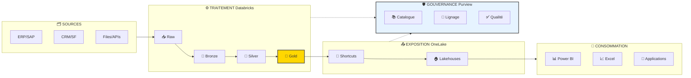

# Flux de données - Vue d'ensemble

```mermaid
%%{init: {"theme": "default"}}%%
flowchart LR
    subgraph Sources["🗂️ SOURCES"]
        ERP["ERP/SAP"]
        CRM["CRM/SF"]
        Files["Files/APIs"]
    end
    
    subgraph Processing["⚙️ TRAITEMENT Databricks"]
        direction TB
        Raw["📥 Raw"]
        Bronze["🥉 Bronze"]
        Silver["🥈 Silver"]
        Gold["🥇 Gold"]
    end
    
    subgraph Exposure["📤 EXPOSITION OneLake"]
        Shortcuts["📎 Shortcuts"]
        Lakehouse["🏠 Lakehouses"]
    end
    
    subgraph Consumption["👥 CONSOMMATION"]
        PBI["📊 Power BI"]
        Excel["📈 Excel"]
        Apps["🔌 Applications"]
    end
    
    subgraph Governance["🛡️ GOUVERNANCE Purview"]
        direction TB
        Catalog["📚 Catalogue"]
        Lineage["🔗 Lignage"]
        Quality["✅ Qualité"]
    end
    
    Sources --> Raw
    Raw --> Bronze
    Bronze --> Silver
    Silver --> Gold
    Gold --> Shortcuts
    Shortcuts --> Lakehouse
    Lakehouse --> Consumption
    
    Processing -.-> Governance
    Exposure -.-> Governance
    
    style Gold fill:#ffd700,stroke:#333,stroke-width:2px
    style Governance fill:#e6f3ff,stroke:#333,stroke-width:2px
```
